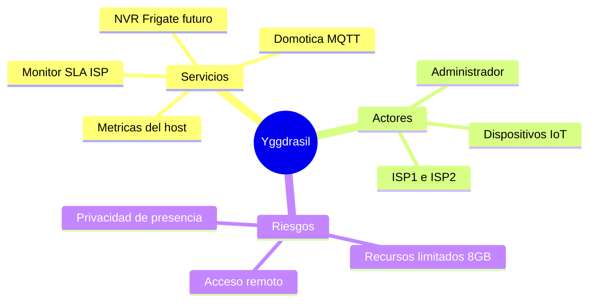

# Project Charter — Yggdrasil

* **Estado:** approved
* **Fecha:** 2026-09-01
* **Decisores:** Jeremi (owner)
* **Fase AI-DLC:** 00-project
* **Versión:** 0.1.0
* **Sponsor:** Jeremi
* **Owner del proyecto:** Jeremi
* **Nombre confirmado:** Yggdrasil (slug `yggdrasil`)
* **Licencia:** GNU AGPL v3.0 (`AGPL-3.0`), decidida el 2026-09-05

## Visión
Plataforma demo de IoT y domótica sobre el appliance doméstico (Ubuntu Server 24.04, Mini-ITX en pared) que monitorea los servicios de la casa; el primer servicio es el control de niveles de servicio (SLA) de los dos proveedores de internet.

## Alcance
- Incluye:
  - Servicio de monitoreo SLA por WAN (latencia, pérdida, jitter, throughput, disponibilidad) para ISP1 e ISP2, con dashboards y alertas.
  - Bus de eventos MQTT como columna vertebral de la plataforma (reutiliza el broker existente).
  - Integración con Node-RED para notificaciones y automatizaciones derivadas.
  - Base extensible para futuros servicios: Frigate NVR, sensores IoT, métricas del host.
- **No incluye (no-scope):**
  - Failover/enrutado dual-WAN (ya cubierto por el proyecto de routing nftables; aquí solo se observa).
  - Exposición de dashboards a internet público (solo LAN y WireGuard).
  - Cámaras Blink (sin RTSP/ONVIF local).

## Mapa mental del alcance

## Stakeholders
| Rol | Nombre | Responsabilidad |
|---|---|---|
| Sponsor / Owner / Operador | Jeremi | Decisiones, operación del appliance |
| Usuarios del hogar | Familia | Consumen internet y domótica |

## Restricciones y supuestos
- Hardware fijo: i3-3240, 8 GB DDR3, disco 456 GB; presupuesto de RAM para monitoreo ≤ 1.5 GB (Frigate llegará después).
- WANs vía adaptadores UE300 sobre tarjeta PCIe VL805 (USB 3.0); el throughput medible está acotado por esa cadena.
- Todo corre en Docker Compose sobre el appliance; sin dependencia de nube.

## Métricas de éxito del proyecto
- Detección de caída de un ISP en < 2 min con notificación al móvil.
- Evidencia histórica exportable para reclamos al proveedor (≥ 30 días de retención).
- Media de disponibilidad mensual de internet del hogar (≥ 1 WAN operativa) y por ISP, calculada automáticamente.
- Cada ISP sostiene p95 < 500 ms y throughput ≥ 800 Mbps (80 % del nominal); p95 < 200 ms como referencia para llamadas críticas.
- Consumo del stack de monitoreo dentro del presupuesto de RAM.

## Riesgos de alto nivel
- Contención de recursos cuando se sume Frigate.
- Conflicto Docker ↔ nftables con las reglas de routing existentes.
- Fatiga de alertas por umbrales mal calibrados.
