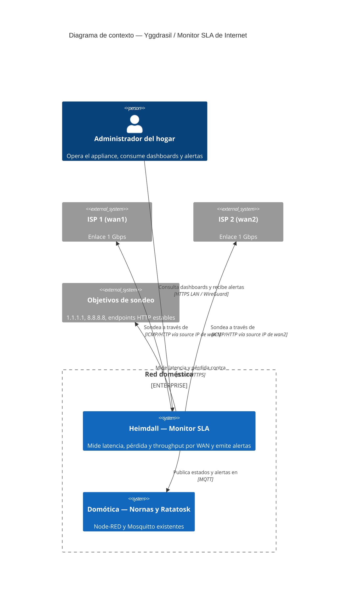
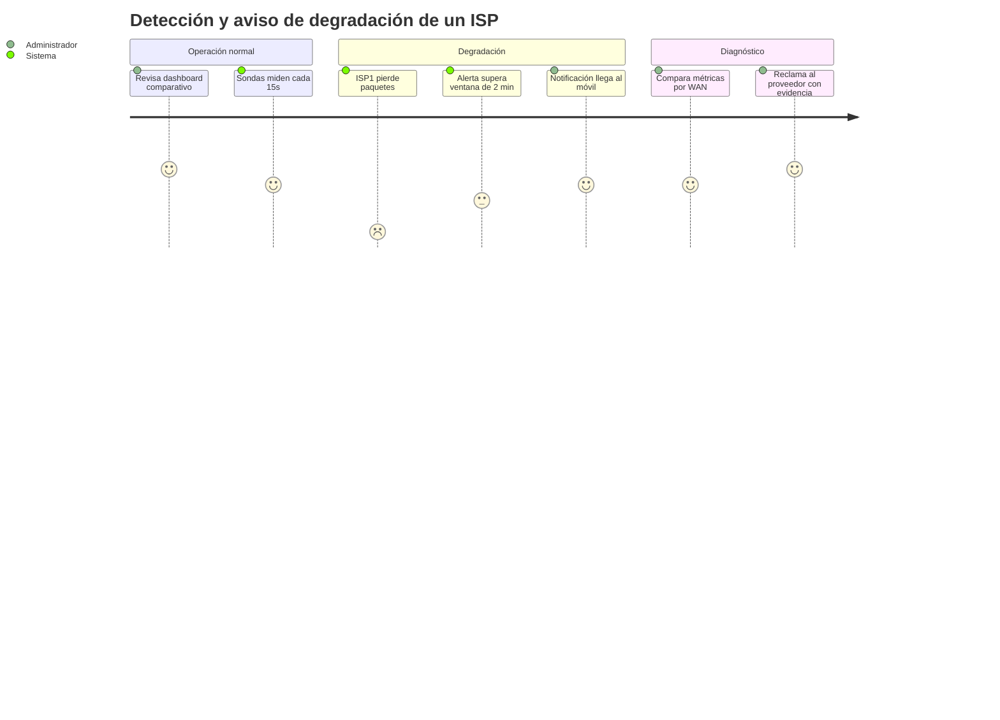
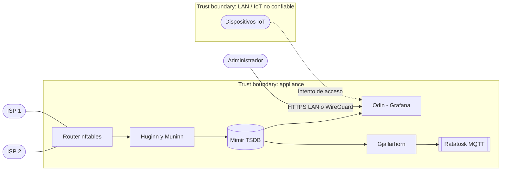
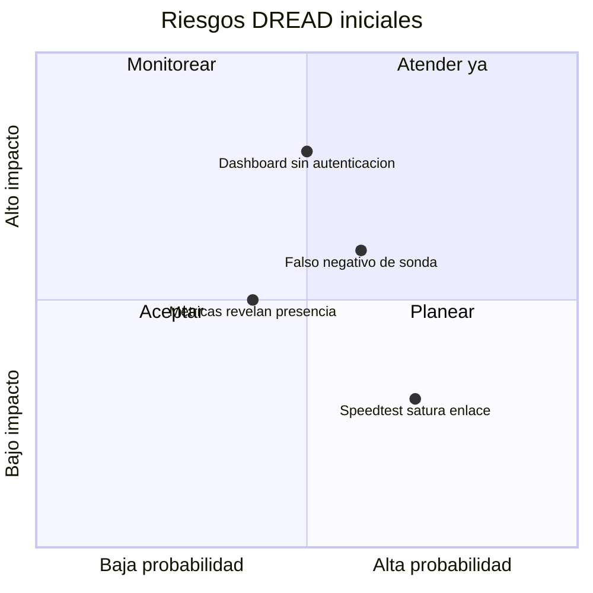

# PRD — Monitor SLA de Internet (dual ISP)

* **Estado:** review
* **Fecha:** 2026-09-01
* **Decisores:** Jeremi
* **Fase AI-DLC:** 01-requirements
* **Versión:** 0.1.0
* **Gate:** 0
* **Feature/Épica ID:** F-001
* **Nivel ASVS objetivo:** L1

## Problema y contexto
La casa tiene dos ISPs de 1 Gbps con balanceo dual-WAN. Hoy no hay forma objetiva de saber si cada proveedor cumple su servicio: cuándo se degrada, cuánto dura una caída, qué throughput real entrega. Se necesita un servicio en el appliance que mida cada WAN de forma independiente, alerte ante degradación y acumule evidencia histórica para reclamos. Es además la primera pieza de la plataforma demo de monitoreo IoT/domótica.

## Objetivos / No-objetivos
Propósito del sondeo (confirmado por el owner el 2026-09-05): llevar registro del SLA que entrega cada proveedor, notificar las caídas del servicio y establecer la media de disponibilidad mensual de internet del hogar.

- Objetivos:
  - Medir por cada WAN: latencia (percentiles p90, p95 y p99), pérdida de paquetes, jitter, disponibilidad y throughput periódico.
  - Alertar en < 2 minutos ante caída total y < 5 minutos ante degradación sostenida.
  - Dashboard comparativo ISP1 vs ISP2 con 30 días de historia.
  - Publicar el estado de cada enlace en MQTT para que la domótica reaccione.
  - Calcular la disponibilidad mensual por ISP y del hogar (al menos una WAN operativa) como evidencia para reclamos y como indicador del servicio de internet de la casa.
- No-objetivos:
  - Conmutar tráfico (el failover vive en el routing nftables, no aquí).
  - Medición pasiva de tráfico de usuarios (privacidad; solo sondeo activo).

## Contexto del sistema (C4 Context)

*Eje estructura · fase 01 · evidencia Gate 0.*

## Usuarios y escenarios
### Journey del usuario

*Eje trazabilidad · fase 01 · evidencia Gate 0.*

### Escenarios positivos
1. Caída total de ISP2 → alerta "WanCaida{wan=wan2}" en < 2 min; `midgard/wan/wan2/estado = caido`; el dashboard muestra el gap.
2. Degradación (pérdida 3% sostenida en ISP1) → alerta de severidad warning en < 5 min; evidencia queda en la TSDB.
3. Reporte mensual: el administrador exporta disponibilidad y p95 por ISP para reclamo.
4. Latencia alta sin pérdida: ISP2 sostiene p95 de 300 ms durante 5 min → sigue Saludable para servicios estándar (< 500 ms) pero `midgard/wan/wan2/apto_llamadas = no` y alerta informativa; la domótica puede avisar antes de una videollamada.
5. Cierre de mes: el dashboard muestra la disponibilidad mensual de cada ISP y la del hogar (tiempo con al menos una WAN operativa), base de la media mensual de disponibilidad de internet de la casa.

### Escenarios negativos / abuso (requerido por Gate 0)
- **Falso negativo por objetivo caído:** si 1.1.1.1 falla globalmente, no debe declararse caído el ISP → se exige quórum de ≥ 2 objetivos por WAN.
- **Abuso del speedtest:** una sonda de throughput mal programada puede saturar el enlace o consumir cuota; frecuencia limitada (cada 6 h, alternando WAN) y ejecutable solo por el scheduler local.
- **Acceso no autorizado al dashboard:** un dispositivo IoT comprometido en la LAN intenta leer métricas o la API de Prometheus → autenticación en Grafana y Prometheus no expuesto fuera de la red interna de Docker/localhost.
- **Manipulación de métricas (tampering):** escritura directa a la TSDB para ocultar una caída → puertos de escritura no expuestos; contenedores sin privilegios innecesarios.
- **Exfiltración de patrones de presencia:** métricas accesibles remotamente solo vía WireGuard.
- **Falso positivo de throughput por techo de medición:** si la cadena USB 3.0 (VL805/UE300), la CPU del host o el servidor de prueba no alcanzan 800 Mbps, la alerta de throughput dispararía siempre → calibrar el techo medible en Gate 3 antes de activar la alerta; si el techo queda por debajo del SLO, evaluar contra el techo calibrado y documentarlo como límite de medición, no del ISP.

## Requisitos funcionales
| ID | Requisito |
|---|---|
| RF01 | Medir latencia, pérdida y jitter por WAN de forma independiente (source IP por interfaz), cada 15 s, contra ≥ 2 objetivos |
| RF02 | Medir throughput por WAN de forma periódica (≥ 4 veces/día, alternando) |
| RF03 | Derivar estado del enlace (Saludable/Degradado/Caído/Recuperando) según los umbrales SLO de la tabla siguiente |
| RF04 | Alertar: caída < 2 min (critical), degradación < 5 min (warning), con notificación push; aviso informativo cuando una WAN deja de ser apta para llamadas |
| RF05 | Publicar en MQTT (retained) el estado `midgard/wan/<id>/estado`, el indicador `midgard/wan/<id>/apto_llamadas` y el estado agregado `midgard/hogar/internet/estado` |
| RF06 | Dashboard comparativo con 30 días de retención |
| RF07 | Registrar percentiles p90, p95 y p99 de latencia por WAN como series de seguimiento (recording rules, ventana 5 min) comparables entre ISP1 e ISP2 |
| RF08 | Calcular la disponibilidad en ventana de 30 días por WAN y del hogar (al menos una WAN operativa) y exponerla en el dashboard y en el reporte mensual |
| RF09 | Evaluar el throughput medido contra el SLO de 800 Mbps por WAN y alertar (warning) tras dos mediciones consecutivas por debajo |
| RNF01 | RAM total del stack ≤ 1.5 GB; CPU media < 10% |
| RNF02 | Arranque automático tras corte de energía (restart policies) |
| RS01 | Acceso a dashboards solo autenticado; acceso remoto solo por WireGuard |

### Umbrales SLO
| SLI | SLO | Ventana | Uso | Estado |
|---|---|---|---|---|
| Pérdida de paquetes | < 1 % | 5 min | Alerta warning → estado Degradado | Confirmado por el owner el 2026-09-05 |
| Disponibilidad (quórum de objetivos) | Fallo simultáneo de ≥ 2 objetivos | 2 min | Alerta critical → estado Caído | Confirmado (RF01) |
| Latencia p95 (servicios estándar) | < 500 ms | 5 min | Alerta warning → estado Degradado | Confirmado por el owner el 2026-09-05 |
| Latencia p95 (llamadas críticas) | < 200 ms | 5 min | Alerta info → indicador `apto_llamadas = no`; no cambia el estado del enlace | Confirmado por el owner el 2026-09-05 |
| Latencia p90 y p99 | Sin umbral | 5 min | Solo seguimiento comparativo ISP1 vs ISP2 | Confirmado el 2026-09-05 |
| Jitter | Sin umbral | 5 min | Solo seguimiento | — |
| Throughput | ≥ 800 Mbps por WAN (80 % del nominal de 1 Gbps) | Medición cada 6 h; alerta tras 2 consecutivas | Alerta warning; no cambia el estado del enlace | Confirmado el 2026-09-05; techo de medición por calibrar (Gate 3) |
| Disponibilidad mensual | Sin umbral de alerta; indicador por ISP y del hogar (≥ 1 WAN operativa) | 30 d | Reporte mensual y dashboard | Confirmado el 2026-09-05 |

### Hosts de sondeo (propuesta por defecto)
| Host | Sonda | Motivo |
|---|---|---|
| `1.1.1.1` | ICMP | Anycast de Cloudflare, estable y cercano |
| `8.8.8.8` | ICMP | Anycast de Google, operador distinto al anterior |
| `https://www.gstatic.com/generate_204` | HTTPS (espera 204) | Verifica DNS y TLS de extremo a extremo, no solo ICMP |

El owner no ha indicado hosts distintos; estos quedan como valor por defecto hasta que Gate 0 los confirme. El quórum de caída exige ≥ 2 fallos simultáneos (RF01).

## Trazabilidad de requisitos

```mermaid
requirementDiagram
    requirement RF01 {
      id: RF01
      text: Medir SLI por WAN de forma independiente con quorum de objetivos
      risk: high
      verifymethod: test
    }
    requirement RF03 {
      id: RF03
      text: Derivar estado del enlace por SLO con perdida mayor a 1 pct en 5 min
      risk: high
      verifymethod: test
    }
    requirement RF04 {
      id: RF04
      text: Alertar caida en menos de 2 min y degradacion en menos de 5 min
      risk: high
      verifymethod: test
    }
    requirement RF05 {
      id: RF05
      text: Publicar estado del enlace en MQTT retained
      risk: medium
      verifymethod: test
    }
    requirement RF07 {
      id: RF07
      text: Registrar percentiles p90 p95 y p99 de latencia por WAN
      risk: low
      verifymethod: inspection
    }
    requirement RF08 {
      id: RF08
      text: Disponibilidad mensual por WAN y del hogar en ventana de 30 dias
      risk: high
      verifymethod: test
    }
    requirement RNF01 {
      id: RNF01
      text: Stack de monitoreo bajo 1.5 GB de RAM
      risk: medium
      verifymethod: analysis
    }
    requirement RS01 {
      id: RS01
      text: Dashboards autenticados y acceso remoto solo por WireGuard
      risk: medium
      verifymethod: inspection
    }
    element Sondas {
      type: "componente"
    }
    element Alertado {
      type: "componente"
    }
    element PuenteMqtt {
      type: "componente"
    }
    element Grafana {
      type: "componente"
    }
    element ReglasSlo {
      type: "componente"
    }
    Sondas - satisfies -> RF01
    Alertado - satisfies -> RF04
    PuenteMqtt - satisfies -> RF05
    Grafana - satisfies -> RS01
    ReglasSlo - satisfies -> RF03
    ReglasSlo - satisfies -> RF07
    ReglasSlo - satisfies -> RF08
```

*Eje trazabilidad · fase 01 · evidencia Gate 0.*

## Requisitos de seguridad (mapeados a OWASP ASVS)
| Req | ASVS | Nivel | OWASP Top 10 |
|---|---|---|---|
| RS01 Autenticación en Grafana, sin acceso anónimo | V2 (Authentication) | L1 | A01/A07 |
| Prometheus/Alertmanager no expuestos fuera de la red interna | V13 (API) | L1 | A01 |
| Credenciales MQTT por servicio, sin anónimo | V2 | L1 | A07 |
| Secrets fuera del repo (env files 600) | V6 (Config) | L1 | A05 |
| Imágenes Docker fijadas por versión y actualizadas | V14 (Dependencias) | L1 | A06 |

## Threat assessment inicial

*Eje comportamiento (DFD) · fase 01 · insumo del threat model.*

*Eje trazabilidad · fase 01 · evidencia Gate 0.*

## Métricas de éxito
- MTTD caída < 2 min; 0 falsos positivos de caída por objetivo único en 30 días.
- Reporte mensual de disponibilidad por ISP generable desde el dashboard.
- Percentiles p90, p95 y p99 de latencia por WAN visibles en el dashboard comparativo con 30 días de historia.
- Media de disponibilidad mensual de internet del hogar y por ISP calculada automáticamente al cierre de cada mes, sin intervención manual.
- Throughput por WAN evaluado contra el SLO de 800 Mbps en cada medición, con el techo de medición calibrado y documentado en el dashboard.

## Dependencias y riesgos
- Depende de: WANs operativas sobre la tarjeta VL805 (verificación pendiente con `lsusb -t`), broker MQTT y Node-RED existentes.
- Riesgo: el throughput medido queda acotado por la cadena USB 3.0/UE300 y por la CPU del i3-3240 al ejecutar la prueba; el SLO de 800 Mbps está cerca de ese techo, así que hay que calibrarlo (Gate 3) y documentarlo como límite de medición, no del ISP. Preferir iperf3 contra un servidor cercano sobre speedtest-cli para reducir el sesgo de CPU.
