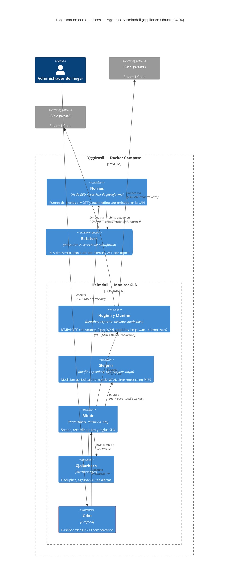
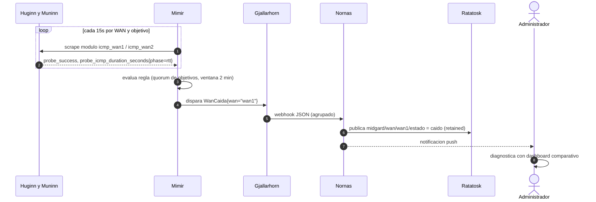
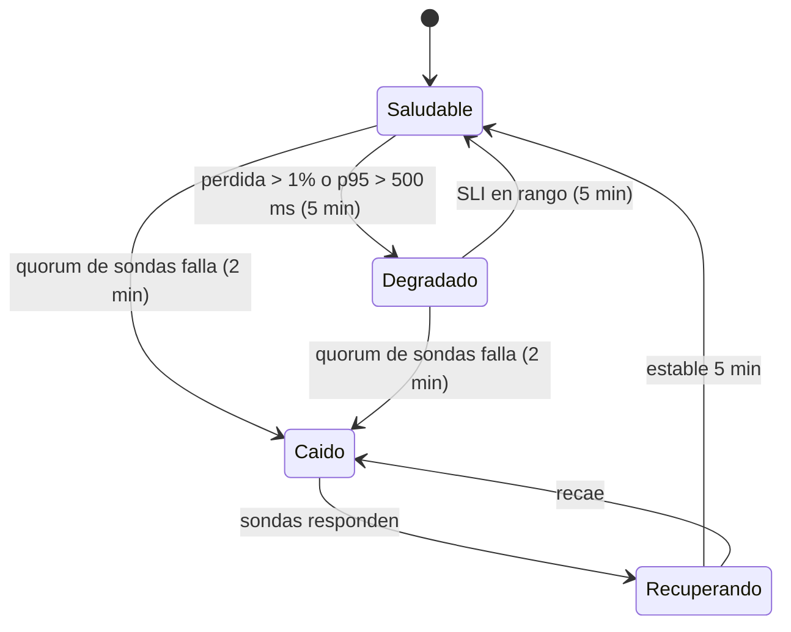
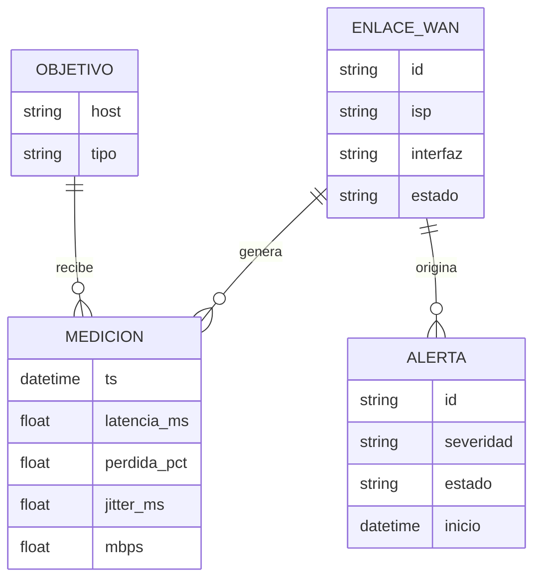
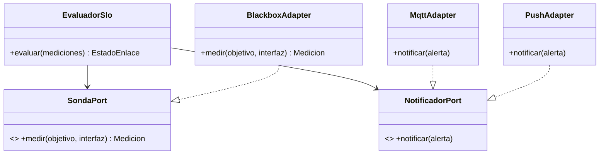

# Diseño del Sistema — Monitor SLA de Internet (Yggdrasil)

* **Estado:** approved
* **Fecha:** 2026-09-01
* **Decisores:** Jeremi
* **Fase AI-DLC:** 02-design
* **Versión:** 0.1.0
* **Gate:** 1
* **Estilo arquitectónico:** Contenedores desacoplados por eventos (puertos/adaptadores en el bridge MQTT)
* **ADRs relacionadas:** ADR-0001, ADR-0002, ADR-0003

## Contextos acotados (DDD)
| Bounded Context | Responsabilidad | Entidades núcleo |
|---|---|---|
| Observabilidad SLA | Medir, evaluar SLO, alertar | EnlaceWan, Medicion, Alerta |
| Domótica/Eventos | Reaccionar al estado de los enlaces | TópicoEstado, Automatización |

## Vista C4 — Container

*Eje estructura · fase 02 · evidencia Gate 1.*

Notas de diseño clave:
- **Medición independiente por WAN**: blackbox_exporter define dos módulos ICMP/HTTP con `source_ip_address` = IP de `wan1` y `wan2`; exige `network_mode: host` (ADR-0003) para ver las interfaces reales y no chocar con el NAT de Docker.
- **Quórum de objetivos** (RF01, anti falso-negativo): cada WAN sondea 1.1.1.1 y 8.8.8.8 por ICMP y `www.gstatic.com:443` por TCP+TLS (el prober http de blackbox no permite fijar la IP de origen, así que el tercer objetivo valida DNS y handshake TLS en lugar de un HTTP 204); la regla de caída exige fallo simultáneo de ≥ 2 objetivos.
- **Umbrales SLO y percentiles** (RF03, RF07, RF09): la pérdida > 1 % o el p95 > 500 ms sostenidos 5 min llevan el enlace a Degradado; el p95 > 200 ms solo apaga el indicador `apto_llamadas` (alerta info) sin cambiar el estado, porque una WAN válida para navegar puede no servir para llamadas. La latencia se registra como p90, p95 y p99 por WAN mediante recording rules con `quantile_over_time` sobre `probe_icmp_duration_seconds{phase="rtt"}` (el RTT real; `probe_duration_seconds` incluye resolución y setup) en ventana de 5 min, porque blackbox_exporter expone un gauge por sonda y no un histograma; p90/p99 son series de seguimiento comparativo entre ISP. El throughput se evalúa contra el 80 % del nominal **contratado con cada ISP, por dirección** — no contra un 800 Mbps fijo: el ISP2 vende 1:0.5, así que la subida de wan2 contrata 500 Mbps y su umbral es 400. Los cuatro umbrales viven en la recording rule `wan:slo_throughput_mbps` (wan1 800/800, wan2 800/400); alerta tras dos mediciones consecutivas por debajo. Umbrales confirmados por el owner el 2026-09-05; el desglose por dirección (ISP2 asimétrico 1:0.5) se revisó con el owner el 2026-09-16.
- **Disponibilidad mensual** (RF08): `wan:up` vale 1 cuando el quórum de sondas responde y `hogar:up = max(wan:up)`. La disponibilidad es `avg_over_time` sobre 30 días por WAN y del hogar, materializada como recording rule para que el dashboard y el reporte mensual no dependan de consultas pesadas sobre 30 días de muestras.
- **Throughput** (RF02, RF09): iperf3 (preferido por su menor coste de CPU en el i3-3240) o speedtest cada 6 h alternando WAN, con `--source` de la interfaz correspondiente; resultado a textfile collector. El techo medible lo impone la cadena VL805/UE300 y se calibra en Gate 3; se documenta en el dashboard junto al SLO de cada WAN y dirección.
- **Ruta real del hogar** (revisión 2026-09-16): las sondas por WAN fijan `source_ip_address`, así que sus paquetes entran por la regla `ip rule from <ip> lookup wanN` y viajan por una tabla que `wan-balancer` mantiene con default propio. Miden la salud de cada **enlace**, que es su cometido, pero ninguna pasa por la tabla `main`, que es por donde salen la LAN, dnsmasq y los contenedores. El 2026-09-12, de 06:20 a 13:25 UTC, `main` se quedó sin ruta utilizable y la casa estuvo 7 h sin internet mientras `hogar:up` valía 1 y no se disparó ninguna alerta. Los módulos `icmp_hogar` y `tls_hogar` (sin IP de origen) cubren ese camino y alimentan `hogar:ruta_up` y la alerta `HogarSinRuta`. `tls_hogar` cubre además la resolución DNS de extremo a extremo, punto único de fallo compartido por ambas WAN que no se ve en ninguna otra sonda.
- **Servicios de plataforma** (ADR-0006): Ratatosk y Nornas los despliega el propio Compose de Yggdrasil, no un stack externo. Ratatosk exige credencial por cliente (`nornas`, `frigate`, `iot`) con ACL por tópico; Nornas lleva editor autenticado y recibe el webhook por la red interna. Con ellos la suma de `mem_limit` queda en 1664 MB (1408 antes de subir el techo de Odín el 2026-09-16). RNF01 no acota esa suma sino la RAM real del stack (≤ 1.5 GB), medida en TA-12: 397 MB de media y 554 MB de pico.
- **Estado → MQTT** (RF05): Node-RED transforma el webhook de Alertmanager en `midgard/wan/<id>/estado`, `midgard/wan/<id>/apto_llamadas` y `midgard/hogar/internet/estado` (retained) y en notificación push; la domótica queda desacoplada del stack de métricas.

## Flujos críticos (comportamiento)

*Eje comportamiento · fase 02 · evidencia Gate 1.*

## Ciclo de vida de la entidad núcleo (EnlaceWan)

*Eje comportamiento · fase 02 · evidencia Gate 1.*

El indicador `apto_llamadas` (p95 < 200 ms y pérdida < 1 %) es ortogonal al estado del enlace: se publica aparte y no añade estados a la máquina.

## Modelo de datos y dominio

*Eje estructura · fase 02. En la práctica EvaluadorSlo son las recording/alerting rules de Prometheus; el modelo de puertos guía dónde enchufar nuevas sondas o notificadores.*

## Contratos de API
No hay REST propio; los contratos de la plataforma son las métricas y los eventos.

Métricas (contrato Prometheus):
| Serie | Labels | Significado |
|---|---|---|
| `probe_success` | `wan`, `target`, `module` | 1/0 por sonda |
| `probe_icmp_duration_seconds{phase="rtt"}` | `wan`, `target` | RTT por sonda ICMP; base de los percentiles (`probe_duration_seconds` incluye resolución y setup) |
| `wan:perdida_pct:5m` (recording) | `wan` | Pérdida agregada por WAN; SLO < 1 % |
| `wan:latencia_p90:5m` (recording) | `wan` | p90 de latencia en 5 min, seguimiento |
| `wan:latencia_p95:5m` (recording) | `wan` | p95 de latencia en 5 min, referencia de SLO |
| `wan:latencia_p99:5m` (recording) | `wan` | p99 de latencia en 5 min, seguimiento |
| `wan:apto_llamadas` (recording) | `wan` | 1 si p95 < 200 ms y pérdida < 1 % en 5 min |
| `wan:up` (recording) | `wan` | 1 si el quórum de sondas responde, 0 si no; base de la disponibilidad |
| `hogar:up` (recording) | — | `max(wan:up)`: 1 si al menos una WAN está operativa |
| `wan:disponibilidad:30d` (recording) | `wan` | `avg_over_time` de `wan:up` en 30 días, disponibilidad mensual por ISP |
| `hogar:disponibilidad:30d` (recording) | — | Disponibilidad mensual de internet del hogar |
| `hogar:ruta_up` | — | Quórum (2 de 3) de las sondas **sin IP de origen**: mide la tabla `main`, la ruta que usa la casa. Complementa a `hogar:up`, que por definición de RF08 mide "al menos una WAN operativa" |
| `wan_throughput_mbps` | `wan`, `direccion` | Resultado periódico de throughput; SLO = `wan:slo_throughput_mbps`, 80 % del nominal contratado por WAN y dirección (RF09) |
| `wan_throughput_medicion_ok` | `wan` | 1 si la última medición de Sleipnir fue válida; condiciona `WanThroughputBajo` |
| `wan_throughput_ultima_medicion_timestamp_seconds` | `wan` | Epoch de la última medición; base de `SleipnirSinMedicion` |
| `wan_throughput_latencia_ms` | `wan` | Latencia reportada por la prueba de throughput (seguimiento) |

Alertas (contrato Alertmanager → Node-RED):
| Alerta | Severidad | Condición | Efecto |
|---|---|---|---|
| `WanCaida` | critical | quórum de sondas falla durante 2 min | estado `caido`, push |
| `WanDegradada` | warning | pérdida > 1 % o p95 > 500 ms durante 5 min | estado `degradado`, push |
| `WanNoAptaLlamadas` | info | p95 > 200 ms durante 5 min | `apto_llamadas = no`, sin push |
| `HogarSinRuta` | critical | `hogar:ruta_up == 0` durante 2 min | push; si las dos `wan:up` valen 1, el fallo es de `main` o del resolutor, no de los ISP |
| `WanThroughputBajo` | warning | 2 mediciones consecutivas < `wan:slo_throughput_mbps`, en cualquiera de las dos direcciones | push |
| `SleipnirSinMedicion` | warning | más de 8 h sin medición válida en una WAN | push |
| `SondaCaida` | warning | Mimir no consigue scrapear una sonda durante 5 min | push |

Eventos (contrato AsyncAPI/MQTT):
| Tópico | Payload | QoS/Retained |
|---|---|---|
| `midgard/wan/<id>/estado` | `saludable\|degradado\|caido\|recuperando` | QoS1, retained |
| `midgard/wan/<id>/apto_llamadas` | `si\|no` | QoS1, retained |
| `midgard/hogar/internet/estado` | `ok\|degradado\|caido` (ok: alguna WAN saludable; caido: ambas caídas) | QoS1, retained |
| `midgard/wan/<id>/alerta` | JSON `{severidad, desde, detalle}` | QoS1 |

## Patrones de seguridad seleccionados (por amenaza DREAD priorizada)
| Amenaza | Patrón / Control | OWASP |
|---|---|---|
| Acceso no autenticado a dashboards | Grafana con login obligatorio, sin anónimo; bind LAN | A01/A07 |
| Lectura directa de Prometheus/Alertmanager | Solo red interna de Compose / localhost, sin publicar puertos a la LAN | A01 |
| Tampering de métricas | Contenedores sin privilegios, volúmenes con permisos mínimos | A05 |
| Exfiltración remota de patrones de presencia | Acceso remoto exclusivo por WireGuard | A02 |
| Imágenes comprometidas | Tags de versión fijos + actualización revisada | A06 |
