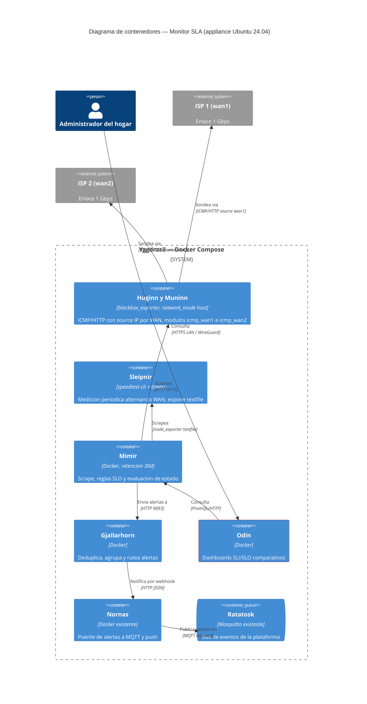
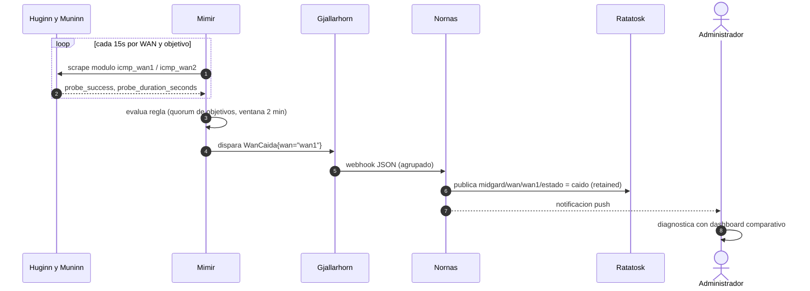
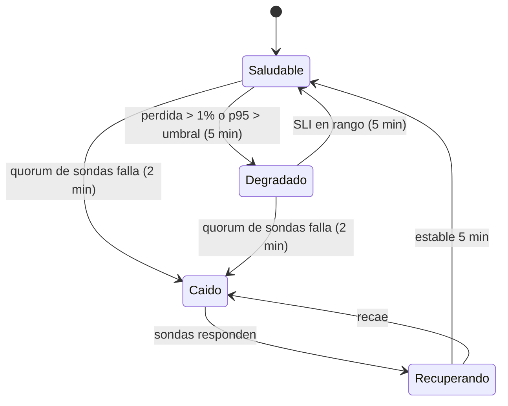
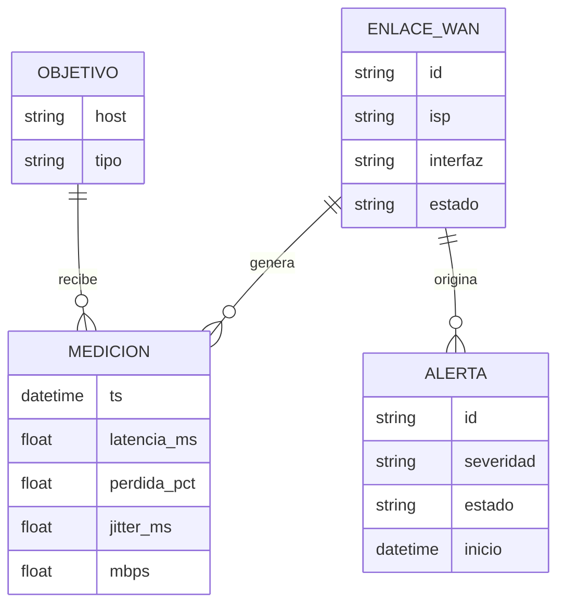
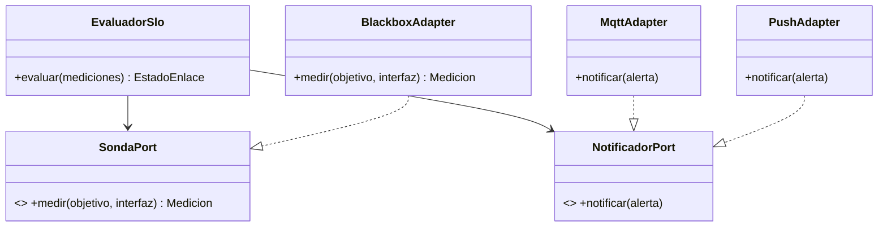

# Diseño del Sistema — Monitor SLA de Internet (Yggdrasil)

* **Estado:** review
* **Fecha:** 2026-09-01
* **Decisores:** Jeremi
* **Fase AI-DLC:** 02-design
* **Versión:** 0.1.0
* **Gate:** 1
* **Estilo arquitectónico:** Contenedores desacoplados por eventos (puertos/adaptadores en el bridge MQTT)
* **ADRs relacionadas:** ADR-0001, ADR-0002, ADR-0003

## Contextos acotados (DDD)
| Bounded Context | Responsabilidad | Entidades núcleo |
|---|---|---|
| Observabilidad SLA | Medir, evaluar SLO, alertar | EnlaceWan, Medicion, Alerta |
| Domótica/Eventos | Reaccionar al estado de los enlaces | TópicoEstado, Automatización |

## Vista C4 — Container

*Eje estructura · fase 02 · evidencia Gate 1.*

Notas de diseño clave:
- **Medición independiente por WAN**: blackbox_exporter define dos módulos ICMP/HTTP con `source_ip_address` = IP de `wan1` y `wan2`; exige `network_mode: host` (ADR-0003) para ver las interfaces reales y no chocar con el NAT de Docker.
- **Quórum de objetivos** (RF01, anti falso-negativo): cada WAN sondea 1.1.1.1, 8.8.8.8 y un endpoint HTTP; la regla de caída exige fallo simultáneo de ≥ 2 objetivos.
- **Umbrales SLO y percentiles** (RF03, RF07): la pérdida > 1 % sostenida 5 min lleva el enlace a Degradado (umbral confirmado el 2026-09-05). La latencia se registra como p90, p95 y p99 por WAN mediante recording rules con `quantile_over_time` sobre `probe_duration_seconds` en ventana de 5 min, porque blackbox_exporter expone un gauge por sonda y no un histograma; p95 es la referencia de SLO (umbral pendiente) y p90/p99 son series de seguimiento comparativo entre ISP.
- **Throughput** (RF02): iperf3/speedtest cada 6 h alternando WAN, con `--source` de la interfaz correspondiente; resultado a textfile collector. El techo medible lo impone la cadena VL805/UE300 — se documenta en el dashboard.
- **Estado → MQTT** (RF05): Node-RED transforma el webhook de Alertmanager en `midgard/wan/<id>/estado` (retained) y en notificación push; la domótica queda desacoplada del stack de métricas.

## Flujos críticos (comportamiento)

*Eje comportamiento · fase 02 · evidencia Gate 1.*

## Ciclo de vida de la entidad núcleo (EnlaceWan)

*Eje comportamiento · fase 02 · evidencia Gate 1.*

## Modelo de datos y dominio

*Eje estructura · fase 02. En la práctica EvaluadorSlo son las recording/alerting rules de Prometheus; el modelo de puertos guía dónde enchufar nuevas sondas o notificadores.*

## Contratos de API
No hay REST propio; los contratos de la plataforma son las métricas y los eventos.

Métricas (contrato Prometheus):
| Serie | Labels | Significado |
|---|---|---|
| `probe_success` | `wan`, `target`, `module` | 1/0 por sonda |
| `probe_duration_seconds` | `wan`, `target` | Latencia por sonda |
| `wan:perdida_pct:5m` (recording) | `wan` | Pérdida agregada por WAN; SLO < 1 % |
| `wan:latencia_p90:5m` (recording) | `wan` | p90 de latencia en 5 min, seguimiento |
| `wan:latencia_p95:5m` (recording) | `wan` | p95 de latencia en 5 min, referencia de SLO |
| `wan:latencia_p99:5m` (recording) | `wan` | p99 de latencia en 5 min, seguimiento |
| `wan_throughput_mbps` | `wan`, `direccion` | Resultado periódico de throughput |

Eventos (contrato AsyncAPI/MQTT):
| Tópico | Payload | QoS/Retained |
|---|---|---|
| `midgard/wan/<id>/estado` | `saludable\|degradado\|caido\|recuperando` | QoS1, retained |
| `midgard/wan/<id>/alerta` | JSON `{severidad, desde, detalle}` | QoS1 |

## Patrones de seguridad seleccionados (por amenaza DREAD priorizada)
| Amenaza | Patrón / Control | OWASP |
|---|---|---|
| Acceso no autenticado a dashboards | Grafana con login obligatorio, sin anónimo; bind LAN | A01/A07 |
| Lectura directa de Prometheus/Alertmanager | Solo red interna de Compose / localhost, sin publicar puertos a la LAN | A01 |
| Tampering de métricas | Contenedores sin privilegios, volúmenes con permisos mínimos | A05 |
| Exfiltración remota de patrones de presencia | Acceso remoto exclusivo por WireGuard | A02 |
| Imágenes comprometidas | Tags de versión fijos + actualización revisada | A06 |
