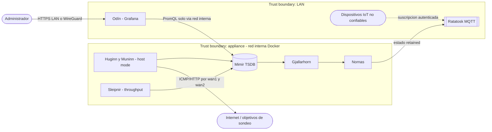
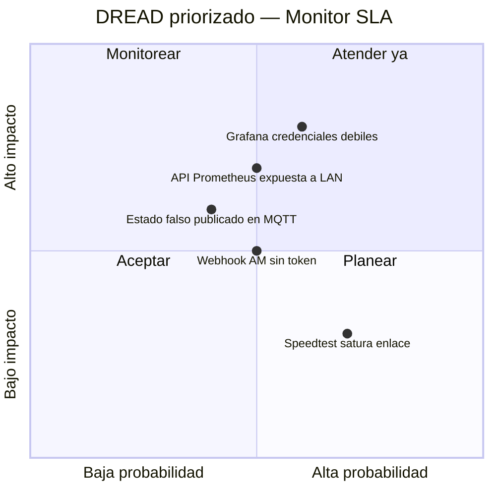

# Threat Model — Monitor SLA de Internet

* **Estado:** approved
* **Fecha:** 2026-09-01
* **Decisores:** Jeremi
* **Fase AI-DLC:** 02-design
* **Versión:** 0.1.0
* **Gate:** 1
* **Alcance:** Servicio Monitor SLA (sondas, TSDB, dashboards, puente MQTT)
* **Metodología:** STRIDE + DREAD
* **Clasificación de datos (ref):** `docs/00-project/data-classification.md`

## Diagrama de flujo de datos (DFD)

*Eje comportamiento (DFD) · fase 02 · insumo del STRIDE.*

## Análisis STRIDE
| Componente | Spoofing | Tampering | Repudiation | Info Disclosure | DoS | Elevation |
|---|---|---|---|---|---|---|
| Grafana | Login por defecto débil → credenciales fuertes, sin anónimo | Edición de dashboards → roles | Logs de acceso activos | Métricas de presencia → solo LAN/WG | Rate limit implícito LAN | Sin plugins no firmados |
| Prometheus | — | Escritura/borrado TSDB → puerto no publicado | — | API abierta → solo red interna | Cardinalidad de labels acotada | Contenedor no-root |
| Blackbox (host) | Objetivos suplantados (DNS) → objetivos por IP + HTTPS | Config de módulos → volumen ro | — | — | Frecuencia de sondas acotada | `cap_add` mínimo (NET_RAW) |
| Alertmanager → Node-RED | Webhook falso → token Bearer en cabecera Authorization, solo por la red interna de Compose | Payload manipulado → validación en flujo | — | — | Agrupación/inhibición configuradas | — |
| MQTT (Ratatosk, 1883 en la IP LAN) | Cliente anónimo → `allow_anonymous false`, credencial por cliente (`nornas`, `frigate`, `iot`) | Publicar estado falso → ACL: solo `nornas` escribe `midgard/#` (ADR-0006) | — | Suscripción abierta → ACL de lectura por usuario | Flood → `max_connections`, `max_queued_messages`, `message_size_limit` | Contenedor con rootfs de solo lectura |
| Node-RED (Nornas, editor 1880 en la IP LAN) | Editor sin login → `adminAuth` obligatorio con bcrypt | Flujos alterados → solo administradores autenticados | Auditoría del runtime activada | — | LAN/WireGuard únicamente | Sin `require` dinámico en functions; paleta instalable solo por admin (riesgo aceptado) |

## Amenazas priorizadas (DREAD)

| ID | Amenaza | D | R | E | A | D | Score | Control / ADR |
|---|---|---|---|---|---|---|---|---|
| T1 | Acceso a Grafana con credenciales por defecto | 7 | 9 | 8 | 5 | 7 | 7.2 | Password fuerte + sin anónimo (RS01) |
| T2 | API de Prometheus alcanzable desde la LAN/IoT | 6 | 8 | 7 | 5 | 6 | 6.4 | No publicar 9090; solo red interna (ADR-0003) |
| T3 | Dispositivo IoT publica estado falso en `midgard/wan/#` | 6 | 6 | 5 | 4 | 5 | 5.2 | ACL de Ratatosk por usuario/tópico, control propio desde ADR-0006 |
| T4 | Webhook Alertmanager→Node-RED falsificado | 5 | 6 | 5 | 4 | 5 | 5.0 | Token Bearer en cabecera + validación en flujo (implementado en Gate 2; el token no queda en logs de acceso) |
| T5 | Sonda de throughput degrada el servicio del hogar | 4 | 8 | 6 | 6 | 3 | 5.4 | Frecuencia 6 h, alternancia, horario valle |

## Controles y trazabilidad
- T1 → RS01 (PRD) · ASVS V2 · verificación por inspección en Gate 3.
- T2, T4 → ADR-0003 (topología de red de contenedores) · ASVS V13.
- T3 → `deploy/mosquitto/acl` (Ratatosk, ADR-0006) — control propio de la plataforma.
- T5 → RF02 y regla de scheduler — verificación por test de carga en Gate 3.
