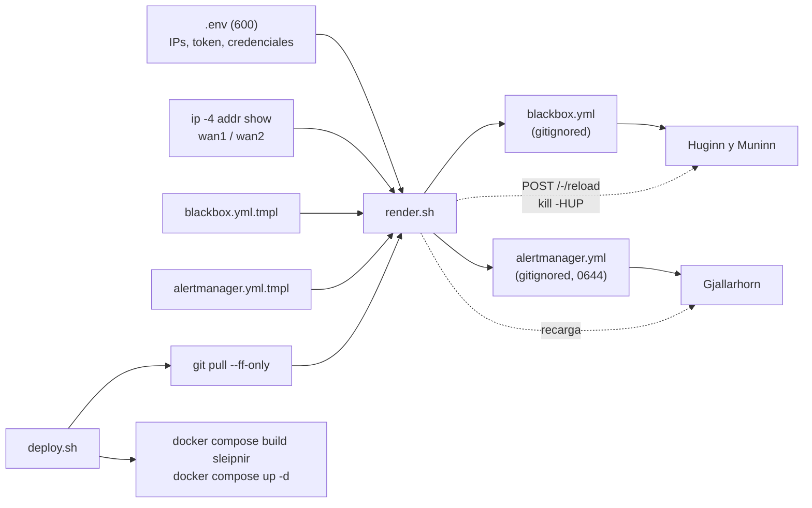
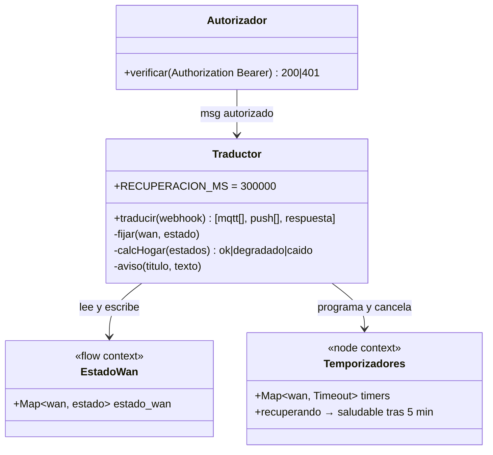

# Implementación — baseline de configuración y cadena de suministro

* **Estado:** review
* **Fecha:** 2026-09-05
* **Decisores:** Jeremi
* **Fase AI-DLC:** 03-implementation
* **Versión:** 0.3.0
* **Gate:** 2
* **Rama principal:** main
* **Estrategia de branching:** GitFlow (`develop` integra, `release/X.Y.Z` corta, `main` solo recibe PR con merge commit)
* **ADRs relacionadas:** ADR-0001 (stack), ADR-0002 (placement y CD), ADR-0003 (red host-mode selectiva), ADR-0004 (frontera con Fenrir)

## Qué significa "implementar" en este proyecto
Heimdall es COTS configurado: blackbox_exporter, Prometheus, Alertmanager y Grafana no se
programan, se configuran. El código propio se reduce a dos piezas pequeñas y revisables: el
script de Sleipnir (`deploy/sleipnir/sleipnir.sh`) y el JavaScript de los dos nodos function del
flujo de Nornas (`deploy/nornas/src/`). Por eso el criterio de Gate 2 se adapta: "SAST limpio +
dependencias verificadas + 80 % de cobertura" pasa a ser **configuración validada con las
herramientas oficiales + cadena de suministro verificada + historial versionado**.

## Inventario de artefactos y trazabilidad
| Elemento del diseño (Gate 1) | Artefacto | Requisitos |
|---|---|---|
| Huginn y Muninn (blackbox_exporter, host-mode) | `deploy/docker-compose.yml` servicio `huginn-muninn`; `deploy/blackbox/blackbox.yml.tmpl` | RF01, RS01 |
| Sleipnir (throughput) | `deploy/sleipnir/Dockerfile`, `sleipnir.sh`; servicio `sleipnir` | RF02, RF09 |
| Mimir (Prometheus, reglas SLO) | `deploy/prometheus/prometheus.yml`, `rules/heimdall-recording.yml`, `rules/heimdall-alertas.yml` | RF01, RF03, RF04, RF06, RF07, RF08, RF09 |
| Gjallarhorn (Alertmanager) | `deploy/alertmanager/alertmanager.yml.tmpl` | RF04 |
| Odín (Grafana) | `deploy/grafana/provisioning/*`, `dashboards/heimdall-sla.json` | RF06, RS01 |
| Nornas (puente MQTT y push) | `deploy/nornas/src/*.js` → `flows/heimdall-alertas.json` | RF04, RF05 |
| Presupuesto y arranque | `mem_limit` (1088 MB en total), `restart: unless-stopped` | RNF01, RNF02 |
| Despliegue (ADR-0002) | `deploy/scripts/render.sh`, `deploy/scripts/deploy.sh`, `deploy/.env.example` | — |
| Cadena de suministro | `deploy/imagenes.md`, `cadena-suministro.md` | A03 |

### Pipeline de render y despliegue

*Eje comportamiento · fase 03 · evidencia Gate 2. Las plantillas viven en el repo; los renderizados nunca.*

## Desviaciones respecto al diseño de Gate 1
Todas quedaron reflejadas en `architecture.md`, `threat-model.md`, el PRD y ADR-0003 en esta misma fase.

| Diseño | Implementación | Motivo |
|---|---|---|
| Tercer objetivo `https://www.gstatic.com/generate_204` por HTTP 204 | `www.gstatic.com:443` por TCP+TLS (módulos `tls_wan1/2`) | El prober `http` de blackbox no admite `source_ip_address`; el handshake TLS valida DNS y TLS de extremo a extremo igualmente |
| Token del webhook en la URL (control de T4) | `Authorization: Bearer` en la cabecera, verificado en el nodo de autorización | No queda en logs de acceso ni en la URL de Alertmanager |
| Sleipnir escribe un textfile para node_exporter | Sleipnir sirve `/metrics` con busybox httpd en :9469 y Mimir lo scrapea | Evita adelantar node_exporter (Thor) solo para esto; el contrato de métricas no cambia |
| Percentiles sobre `probe_duration_seconds` | Sobre `probe_icmp_duration_seconds{phase="rtt"}` | Mide el RTT real; la otra serie incluye resolución y setup |
| Puertos host-mode en el host | Ligados a la IP de docker0 (`DOCKER_HOST_GW`); Mimir entra por `host.docker.internal` | La LAN no los ve aunque falle la política INPUT de nftables, que queda como segunda barrera |

## Estrategia de ramas y releases
GitFlow: `feature/*` nace de `develop` y vuelve por PR; cada gate se corta en `release/X.Y.Z`,
entra en `main` por PR con merge commit (ruleset `Protect-MAIN` y check `GitFlow guard`), recibe
el tag `vX.Y.Z` y se back-mergea a `develop`. El grafo derivado del historial real y la tabla
tag ↔ versión ↔ decisión están en `repo-history.md`, regenerable con
`python scripts/generar-historial.py`.

## Validación de configuración (equivalente a SAST)
Las herramientas oficiales de cada componente validan los artefactos antes de tocar el appliance;
la misma batería corre en GitHub Actions (`validar-configs.yml`) en cada PR que toque `deploy/`.

| Qué | Cómo | Resultado 2026-09-05 |
|---|---|---|
| Compose interpola y es válido | `docker compose config -q` con `.env` de prueba | OK |
| Configuración y reglas de Mimir | `promtool check config`, `promtool check rules` | OK: 9 recording rules, 6 alertas |
| Configuración de Gjallarhorn | `amtool check-config` | OK: 1 inhibición, 2 receptores |
| Módulos de Huginn y Muninn | `blackbox_exporter --config.check` | OK |
| Dashboard y flujo de Nornas | `json.tool`; el flujo se regenera desde `src/` y debe coincidir | OK |
| Imagen de Sleipnir | `docker compose build sleipnir` + prueba de humo del contenedor | OK (28 MB, uid 65532, `/metrics` servido) |
| Scripts de shell | ShellCheck nivel warning | OK |

La prueba de humo local encontró dos fallos antes del despliegue: el rootfs de solo lectura impedía
crear el directorio de datos (ahora nace en la imagen) y la busybox de Alpine no trae `httpd`
(paquete `busybox-extras`). Un tercero apareció en CI: Git para Windows no registra el bit de
ejecución de los scripts (`git update-index --chmod=+x`).

### Traductor de Nornas (nivel Code)

*Eje estructura · fase 03. El estado por WAN y los temporizadores viven en el contexto de Node-RED; una caída cancela cualquier recuperación pendiente.*

## Cadena de suministro (OWASP A03)
Imágenes pineadas por tag inmutable y digests anotados en `deploy/imagenes.md`; la base de Sleipnir
va pineada por digest en su `Dockerfile` y su única dependencia Python (`speedtest-cli==2.1.3`) está
fijada. Trivy escanea las cinco imágenes en cada PR y, con el triaje de `cadena-suministro.md`, es
la base de la decisión HITL de Gate 2.

## Secretos (OWASP A02)
`deploy/.env`, `blackbox.yml` y `alertmanager.yml` renderizados están gitignored; `.env.example`
usa el rango RFC 5737 y `CAMBIAR`. gitleaks corre en CI sobre todo el historial. El token del
webhook viaja en cabecera y el `alertmanager.yml` renderizado queda en 0644 dentro de un directorio
de despliegue con permisos restringidos (`deploy/README.md`).

## Riesgos abiertos que entran al Gate 3
- **Techo de medición de throughput.** El SLO de 800 Mbps está cerca del límite de la cadena USB 3.0
  y de la CPU del i3-3240; `WanThroughputBajo` nace inhibida (receptor nulo) hasta calibrarlo.
- **Cambio de IP de las WAN.** `render.sh` debe engancharse al hook DHCP del proyecto de routing; si
  no, las sondas seguirían saliendo por la IP antigua.
- **Prerrequisitos del host.** `ping_group_range`, reglas nftables para 9115/9469/3000 y las
  `ip rule from <ip>` del routing; sin ellas las sondas no miden por WAN.
- **Nornas.** El flujo asume `NORNAS_WEBHOOK_TOKEN` en el entorno de Node-RED, el broker apuntando a
  Ratatosk con ACL `midgard/#` y la salida push aún sin conectar.
- **Speedtest sin servidor propio.** El modo `speedtest` depende de servidores públicos de Ookla;
  `iperf3` contra un servidor conocido daría medidas más estables.
