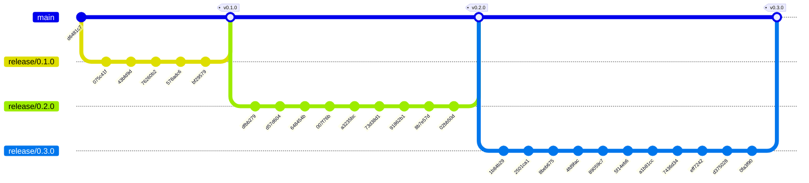
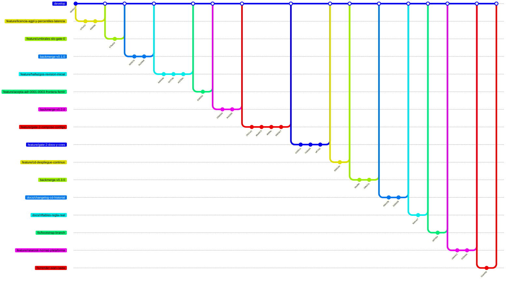

# Historial de implementación — Yggdrasil

* **Estado:** review
* **Fecha:** 2026-09-05
* **Decisores:** Jeremi
* **Fase AI-DLC:** 03-implementation
* **Versión:** 0.3.0
* **Gate:** 2
* **Rama principal:** main
* **Estrategia de branching:** GitFlow

Documento generado por `scripts/generar-historial.py` a partir de `git log`; no editar a mano.
Regenerar tras cada merge o tag. Los tags SemVer enlazan con las versiones del `CHANGELOG.md`.

## Vista de releases (`main`, primer padre)
`main` solo recibe merges de `release/*` (y `hotfix/*`) por PR con merge commit; cada merge lleva su tag.

*Eje trazabilidad · fase 03 · evidencia Gate 2.*

## Vista de integración (`develop`)
Features por PR; los bloques `backmerge-*` son los merges de `main` a `develop` tras cada release.

*Eje trazabilidad · fase 03 · evidencia Gate 2.*

## Trazabilidad tag ↔ versión ↔ decisión
| Tag | Versión CHANGELOG | ADR / decisión | Nota |
|---|---|---|---|
| v0.1.0 | 0.1.0 (Gate 0) | Umbrales SLO y hosts de sondeo confirmados; licencia AGPL-3.0 | release/0.1.0 desde la punta del PR #2 |
| v0.2.0 | 0.2.0 (Gate 1) | ADR-0001, ADR-0003 aceptados; ADR-0004 frontera con Fenrir | release/0.2.0 desde develop |
| v0.3.0 | — | — | — |

## Bitácora de cambios (fiel al repo)
| Commit | Tipo | Tags | Autor | Fecha | Mensaje |
|---|---|---|---|---|---|
| `c6efac2` | merge | — | Jeremi J. Alcalá M. | 2026-09-05 | Merge pull request #15 from higerotech/fix/render-wan-caida |
| `02a0458` | commit | — | Jeremi Alcala | 2026-09-05 | fix(deploy): render.sh conserva la ultima IP conocida si una WAN no tiene IPv4 |
| `c66b21d` | merge | — | Jeremi J. Alcalá M. | 2026-09-05 | Merge pull request #14 from higerotech/feature/ratatosk-nornas-plataforma |
| `023e0da` | commit | — | Jeremi Alcala | 2026-09-05 | docs: ADR-0006 y contratos con Ratatosk y Nornas como servicios propios; historial regenerado |
| `c9e9412` | commit | — | Jeremi Alcala | 2026-09-05 | feat(deploy): Ratatosk y Nornas como servicios de plataforma (ADR-0006) |
| `d8e728a` | merge | — | Jeremi J. Alcalá M. | 2026-09-05 | Merge pull request #13 from higerotech/fix/bootstrap-branch |
| `d0f765e` | commit | — | Jeremi Alcala | 2026-09-05 | fix(cd): el bootstrap acepta BRANCH para el clon inicial |
| `a20481a` | merge | — | Jeremi J. Alcalá M. | 2026-09-05 | Merge pull request #12 from higerotech/docs/nftables-regla-real |
| `8a0cce7` | commit | — | Jeremi Alcala | 2026-09-05 | docs(cd): la regla nftables real de las sondas y comprobacion en el bootstrap |
| `8d2073a` | merge | — | Jeremi J. Alcalá M. | 2026-09-05 | Merge pull request #11 from higerotech/docs/changelog-cd-historial |
| `2d3b928` | commit | — | Jeremi Alcala | 2026-09-05 | docs: CHANGELOG del despliegue continuo e historial regenerado con v0.3.0 |
| `48dc03b` | merge | — | Jeremi Alcala | 2026-09-05 | Merge develop (v0.3.0) en feature/cd-despliegue-continuo |
| `1544e6d` | merge | — | Jeremi Alcala | 2026-09-05 | Merge main (v0.3.0) en develop |
| `d97b3fd` | merge | — | Jeremi J. Alcalá M. | 2026-09-05 | Merge pull request #10 from higerotech/feature/cd-despliegue-continuo |
| `58fe37a` | merge | v0.3.0 | Jeremi J. Alcalá M. | 2026-09-05 | Merge pull request #9 from higerotech/release/0.3.0 |
| `8360c94` | commit | — | Jeremi Alcala | 2026-09-05 | feat(cd): despliegue continuo con el receptor de despliegue-continuo (ADR-0005) |
| `0fa3f90` | commit | — | Jeremi Alcala | 2026-09-05 | release: cierra Gate 2 y corta 0.3.0 |
| `d375028` | merge | — | Jeremi J. Alcalá M. | 2026-09-05 | Merge pull request #8 from higerotech/feature/gate-2-docs-y-cves |
| `eff7242` | commit | — | Jeremi Alcala | 2026-09-05 | docs: checklist de Gate 2 al dia, mapa del repo y CHANGELOG |
| `7436d34` | commit | — | Jeremi Alcala | 2026-09-05 | fix(deploy): re-pinea las imagenes a las releases parcheadas de 2026 tras el triaje de Trivy |
| `a1b81cc` | commit | — | Jeremi Alcala | 2026-09-05 | docs(03-implementation): baseline de configuracion, triaje de CVEs e historial derivado del git log |
| `5f14eb6` | merge | — | Jeremi J. Alcalá M. | 2026-09-05 | Merge pull request #7 from higerotech/feature/gate-2-compose-configs |
| `89059c7` | commit | — | Jeremi Alcala | 2026-09-05 | fix(deploy): bit de ejecucion en scripts y resumen del primer informe Trivy |
| `4fd9fac` | commit | — | Jeremi Alcala | 2026-09-05 | ci: valida deploy/ y abre la checklist de Gate 2 |
| `8beb675` | commit | — | Jeremi Alcala | 2026-09-05 | feat(deploy): sonda Sleipnir y flujo de Nornas |
| `2501ca1` | commit | — | Jeremi Alcala | 2026-09-05 | feat(deploy): compose y configuraciones de Heimdall (Gate 2) |
| `1b84b29` | merge | — | Jeremi Alcala | 2026-09-05 | Merge main (v0.2.0) en develop |
| `9c62856` | merge | v0.2.0 | Jeremi J. Alcalá M. | 2026-09-05 | Merge pull request #6 from higerotech/release/0.2.0 |
| `02bb50d` | commit | — | Jeremi Alcala | 2026-09-05 | release: cierra Gate 1 y corta 0.2.0 |
| `8b7e57d` | merge | — | Jeremi Alcala | 2026-09-05 | Merge pull request #5 from higerotech/feature/acepta-adr-0001-0003-frontera-fenrir |
| `91862b1` | commit | — | Jeremi Alcala | 2026-09-05 | docs(adr): acepta ADR-0001 y ADR-0003 y fija la frontera con Fenrir en ADR-0004 |
| `73d38d1` | merge | — | Jeremi Alcala | 2026-09-05 | Merge pull request #4 from higerotech/feature/hallazgos-revision-inicial |
| `a3235bc` | commit | — | Jeremi Alcala | 2026-09-05 | docs(prd): divide el requirementDiagram en dos vistas para que renderice legible |
| `007f76b` | commit | — | Jeremi Alcala | 2026-09-05 | docs(diagramas): completa la trazabilidad y alinea ids y nombres con naming.md |
| `648454b` | commit | — | Jeremi Alcala | 2026-09-05 | docs: alinea rutas de gates y ADR con el estandar AI-DLC polyrepo |
| `d57d604` | merge | — | Jeremi Alcala | 2026-09-05 | Merge main (v0.1.0) en develop |
| `5a160b8` | merge | v0.1.0 | Jeremi J. Alcalá M. | 2026-09-05 | Merge pull request #3 from higerotech/release/0.1.0 |
| `dfbb279` | merge | — | Jeremi J. Alcalá M. | 2026-09-05 | Merge pull request #2 from higerotech/feature/umbrales-slo-gate-0 |
| `bf29579` | commit | — | Jeremi Alcala | 2026-09-05 | release: cierra Gate 0 y corta 0.1.0 |
| `578adc6` | commit | — | Jeremi Alcala | 2026-09-05 | docs(prd): cierra umbrales SLO de Gate 0: p95 500/200 ms, throughput 800 Mbps y disponibilidad mensual |
| `76260b2` | merge | — | Jeremi J. Alcalá M. | 2026-09-05 | Merge pull request #1 from higerotech/feature/licencia-agpl-y-percentiles-latencia |
| `43bfd9d` | commit | — | Jeremi Alcala | 2026-09-05 | docs(prd): confirma umbral de perdida 1% y registra p90, p95 y p99 de latencia por WAN |
| `075c41f` | commit | — | Jeremi Alcala | 2026-09-05 | chore: adopta la licencia GNU AGPL v3.0 para Yggdrasil |
| `d6481c7` | commit | — | Jeremi Alcala | 2026-09-05 | chore: commit inicial de Yggdrasil con documentacion AI-DLC (fases 00-02) y configuracion GitFlow |
