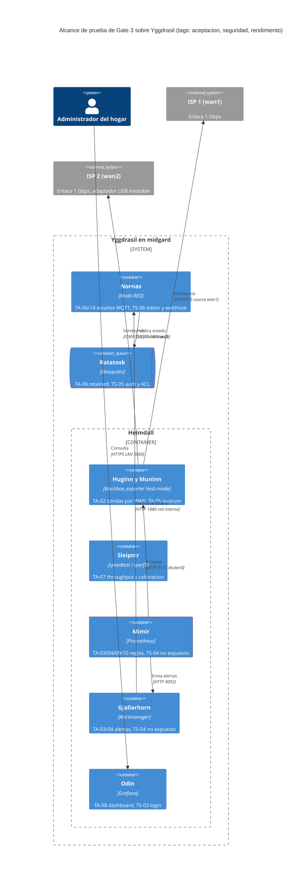
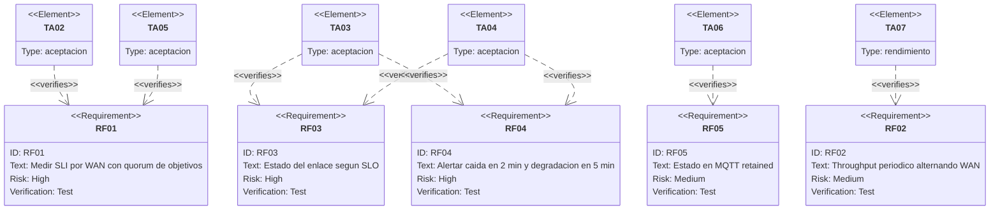
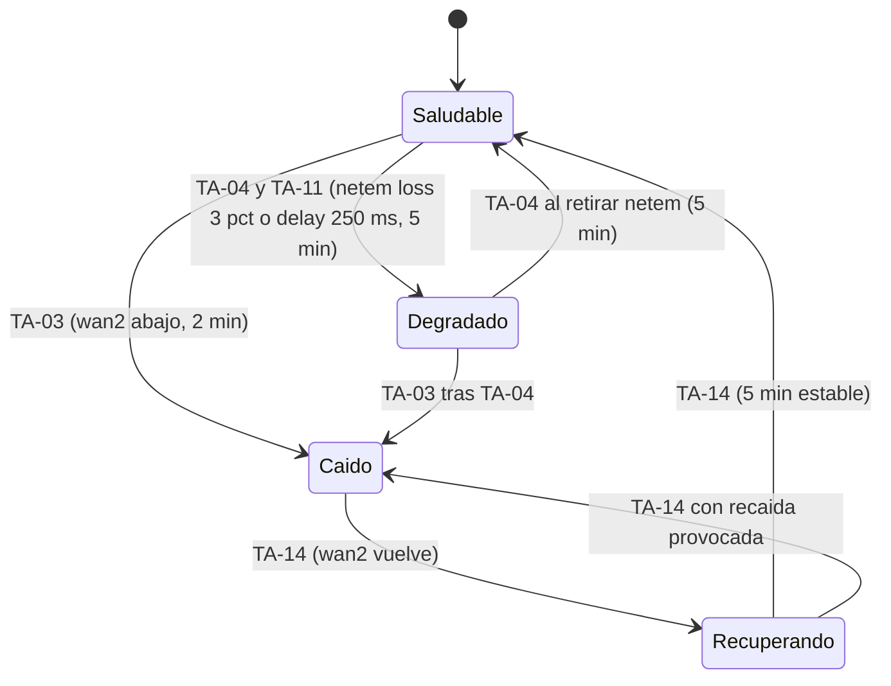

# Plan de verificación — Heimdall (Monitor SLA de internet)

* **Estado:** draft
* **Fecha:** 2026-09-05
* **Decisores:** Jeremi
* **Fase AI-DLC:** 04-testing
* **Versión:** 0.4.0
* **Gate:** 3
* **Alcance de prueba:** el sistema desplegado en midgard por el despliegue continuo (ADR-0005); no hay unidades de código que probar salvo dos scripts y dos nodos function
* **Requisitos cubiertos:** RF01–RF09, RNF01–RNF02, RS01, escenarios de abuso del PRD, amenazas T1–T5

## Estrategia
Heimdall es COTS configurado, así que la pirámide clásica se aplana en cuatro capas, cada una con su
puerta:

| Capa | Qué verifica | Dónde | Estado |
|---|---|---|---|
| Configuración | Sintaxis y semántica de Compose, reglas, Alertmanager, blackbox, flujo y scripts | CI `validar-configs.yml` en cada PR | Verde desde Gate 2 |
| Integración (despliegue) | Build → GHCR → webhook firmado → receptor → `pull` + `up -d` → sync → healthcheck | Primer despliegue de `v0.4.0` en midgard | **TA-01, arranque de Gate 3** |
| Aceptación funcional | RF01–RF09 y RNF01–RNF02 sobre el sistema real, con las WAN reales y fallos provocados | midgard, con `tc netem` y nftables para inducir pérdida, latencia y caídas | Este plan |
| Seguridad (DAST equivalente) | Los abusos del PRD y las amenazas T1–T5 como casos ejecutables: puertos, autenticación, ACL, secretos | Desde la LAN, desde una WAN externa y desde dentro de los contenedores | Este plan |
| Rendimiento | RNF01 (RAM y CPU) y calibración del techo de throughput que decide si `WanThroughputBajo` se activa | midgard, 24 h de datos reales | Este plan |

La evidencia se registra en este documento como resultado por caso (fecha, comando o consulta,
valor observado); nunca se copian IPs públicas ni credenciales (repo público). Los diagramas de
`architecture.md` no se duplican: aquí se anotan con el alcance de prueba.

## Alcance de prueba sobre la arquitectura

*Eje estructura · fase 04 · alcance de Gate 3. Rojo: superficies con caso de seguridad propio.*

## Trazabilidad requisito ↔ prueba

*Eje trazabilidad · fase 04 · medición y alertado.*

```mermaid
requirementDiagram
    requirement RF06 {
      id: RF06
      text: Dashboard comparativo con 30 dias
      risk: medium
      verifymethod: demonstration
    }
    requirement RF07 {
      id: RF07
      text: Percentiles p90 p95 p99 por WAN
      risk: low
      verifymethod: inspection
    }
    requirement RF08 {
      id: RF08
      text: Disponibilidad 30 dias por WAN y del hogar
      risk: high
      verifymethod: test
    }
    requirement RF09 {
      id: RF09
      text: Throughput contra 800 Mbps tras calibrar
      risk: medium
      verifymethod: test
    }
    requirement RNF01 {
      id: RNF01
      text: RAM bajo 1.5 GB y CPU media bajo 10 pct
      risk: medium
      verifymethod: analysis
    }
    requirement RNF02 {
      id: RNF02
      text: Arranque automatico tras corte
      risk: medium
      verifymethod: test
    }
    requirement RS01 {
      id: RS01
      text: Dashboards autenticados y acceso remoto solo por WireGuard
      risk: medium
      verifymethod: test
    }
    element TA08 {
      type: "aceptacion"
    }
    element TA09 {
      type: "aceptacion"
    }
    element TA10 {
      type: "aceptacion"
    }
    element TA07b {
      type: "rendimiento"
    }
    element TA12 {
      type: "rendimiento"
    }
    element TA13 {
      type: "aceptacion"
    }
    element TS03 {
      type: "seguridad"
    }
    TA08 - verifies -> RF06
    TA09 - verifies -> RF07
    TA10 - verifies -> RF08
    TA07b - verifies -> RF09
    TA12 - verifies -> RNF01
    TA13 - verifies -> RNF02
    TS03 - verifies -> RS01
```

*Eje trazabilidad · fase 04 · observabilidad, no funcionales y seguridad. Cierra el círculo abierto en Gate 0 con relaciones `verifies`.*

## Casos de aceptación
Cada caso indica cómo se provoca la condición, qué se observa y dónde queda la evidencia. Los fallos
de red se inducen en midgard con `tc qdisc ... netem` sobre `wan1`/`wan2` y con reglas nftables
temporales; se retiran al terminar (`tc qdisc del dev wanN root`).

| ID | Requisito | Cómo | Resultado esperado | Evidencia |
|---|---|---|---|---|
| TA-01 | ADR-0005 | Fusionar `release/0.4.0` en `main`; observar el workflow `build`, el receptor (`/status`, journal) y `docker compose ps` | Imágenes `sha-<7>` en GHCR; despliegue `ok` con healthcheck de Odín; `sync-host` y `sync-net` salen con 0; 8 servicios arriba | `/status`, logs de sync, `docker compose ps` |
| TA-02 | RF01 | En Mimir: `probe_success{job=~"blackbox_.*"}` por `wan` y `target`; contadores `ip -s link` de cada WAN durante 5 min | 6 series (2 WAN × 3 objetivos) con valor 1; los contadores de ambas WAN crecen | Consulta PromQL, captura de Odín |
| TA-03 | RF03, RF04 | Retirar el cable de `wan2` (o `ip link set wan2 down`) y cronometrar | `WanCaida{wan="wan2"}` firing en < 2 min; `midgard/wan/wan2/estado = caido` retained; push recibido | Alertmanager `/api/v2/alerts`, `mosquitto_sub`, hora del push |
| TA-04 | RF03, RF04 | `tc qdisc add dev wan1 root netem loss 3%` durante 6 min | `wan:perdida_pct:5m{wan="wan1"} > 1`; `WanDegradada` en < 5 min; `estado = degradado`; al retirar, vuelve a `saludable` | PromQL, Alertmanager, MQTT |
| TA-05 | RF01 (quórum) | Bloquear solo 1.1.1.1 con nftables (`ip daddr 1.1.1.1 drop` en output) 5 min | `probe_success` de 1.1.1.1 = 0 en ambas WAN; `wan:up` sigue en 1; **no** hay `WanCaida` | PromQL, Alertmanager |
| TA-06 | RF05 | `mosquitto_sub -u iot -t 'midgard/#' -v` tras TA-03 y TA-04 | Mensajes retained en `midgard/wan/<id>/estado`, `midgard/wan/<id>/apto_llamadas` y `midgard/hogar/internet/estado` coherentes con las alertas | Salida de `mosquitto_sub` |
| TA-07 | RF02, RF09 | Esperar dos ciclos de Sleipnir (6 h) y ejecutar la calibración (abajo) | `wan_throughput_mbps` para ambas WAN y direcciones; alternancia visible en `wan_throughput_ultima_medicion_timestamp_seconds`; techo calibrado documentado | PromQL, tabla de calibración |
| TA-08 | RF06 | Abrir el dashboard `heimdall-sla` con rango 30 d; comprobar `--storage.tsdb.retention.time=30d` | Paneles con datos de ambas WAN; retención configurada | Captura anonimizada, `docker inspect` |
| TA-09 | RF07 | `wan:latencia_p90:5m`, `p95`, `p99` por WAN | Tres series por WAN, p90 ≤ p95 ≤ p99 | PromQL |
| TA-10 | RF08 | `wan:disponibilidad:30d` y `hogar:disponibilidad:30d` antes y después de TA-03 | Valores en (0,1]; el de `wan2` baja tras la caída; el del hogar se mantiene si `wan1` siguió arriba | PromQL |
| TA-11 | apto_llamadas | `tc qdisc add dev wan1 root netem delay 250ms` 6 min | `wan:apto_llamadas{wan="wan1"} = 0`; `WanNoAptaLlamadas` firing; `estado` sigue `saludable`; MQTT `apto_llamadas = no` | PromQL, MQTT |
| TA-12 | RNF01 | `docker stats --no-stream` cada hora durante 24 h (script) | Suma de RAM de los contenedores de Yggdrasil ≤ 1.5 GB; CPU media < 10 % del host | Tabla horaria |
| TA-13 | RNF02 | `sudo reboot` del appliance | Los 8 servicios vuelven solos; Odín responde; sondas miden | `docker compose ps`, `uptime` |
| TA-14 | RF03 (Recuperando) | Tras TA-03, reconectar `wan2` y cronometrar | `estado = recuperando` al resolverse la alerta y `saludable` a los 5 min sin recaída | MQTT con marcas de tiempo |

## Pruebas de seguridad (equivalente DAST): los abusos del PRD como casos
| ID | Amenaza / abuso | Cómo | Resultado esperado |
|---|---|---|---|
| TS-01 | T2, puertos internos | `nmap -Pn -p- <IP LAN>` desde un equipo de la LAN | Abiertos solo 22, 53, 3000, 1880, 1883 y los previos del router (9091, WireGuard); 9090, 9093, 9115 y 9469 filtrados |
| TS-02 | Exposición a internet | `nmap -Pn -p 22,1880,1883,3000,9090,9093,9115,9469 <IP pública>` desde fuera (móvil en datos) | Todo filtrado; solo WireGuard y el puerto de Transmission responden |
| TS-03 | T1, RS01 | `curl -I http://<IP LAN>:3000/api/dashboards/uid/heimdall-sla` sin sesión; login con la cuenta de `.env` | 401 sin sesión; anónimo deshabilitado; login correcto |
| TS-04 | T2 | `curl http://<IP LAN>:9090/api/v1/status/config` y `:9093/api/v2/status` desde la LAN | Sin respuesta (filtrado) |
| TS-05 | T3 | `mosquitto_sub` anónimo; `mosquitto_pub -V mqttv5 -u iot` en `midgard/x`; `-u frigate` en `midgard/x` y en `frigate/x` | Anónimo rechazado; `iot` y `frigate` en `midgard/#` reciben 135; `frigate` en `frigate/#` recibe 16 |
| TS-06 | T4 | `curl -X POST http://<IP LAN>:1880/heimdall/alertas -d '{}'` sin Bearer; editor sin login | 401 en el webhook; el editor exige credenciales |
| TS-07 | Elevation | `docker inspect` de cada contenedor: `User`, `CapAdd`, `ReadonlyRootfs`, `SecurityOpt` | Sin root salvo Mosquitto (baja privilegios), solo `NET_RAW` en blackbox, rootfs ro donde aplica, `no-new-privileges` |
| TS-08 | A05 secretos | `stat` de `deploy/.env`; `gitleaks` en CI; token no aparece en URLs de Alertmanager | 0600 `deploy`; CI limpia; token solo en cabecera |
| TS-09 | A06 supply chain | `docker inspect --format '{{index .RepoDigests 0}}'` de cada imagen vs `deploy/imagenes.md` | Digests coinciden |
| TS-10 | Tampering | Intentar escribir en Mimir desde la LAN (`curl -X POST :9090/api/v1/admin/tsdb/...`) | Inalcanzable; además la API de administración está deshabilitada |

## Pruebas de transición de estado (EnlaceWan)

*Eje comportamiento · fase 04 · state-transition testing. Transición inválida a comprobar: Caído nunca pasa a Saludable sin Recuperando (el flujo de Nornas lo impide).*

## Rendimiento y calibración del techo de throughput
- **RNF01** (TA-12): la suma de `mem_limit` es 1408 MB; se mide el uso real con `docker stats` durante
  24 h. Si Mimir supera 400 MB sostenidos, revisar cardinalidad y `retention` antes de tocar límites.
- **Latencia de alertado** (TA-03/TA-04): el cronómetro arranca al inducir el fallo y termina cuando
  el push llega; el SLO es 2 min para caída y 5 min para degradación.
- **Calibración** (TA-07): conectar un portátil con `iperf3 -s` al segmento de cada módem
  (192.168.1.x y 192.168.2.x) y desde midgard `iperf3 -c <portátil> -B <IP de la WAN> -t 20` en ambos
  sentidos: ese valor es el **techo de la cadena USB/UE300** por WAN. Comparar con `speedtest-cli
  --source <IP>` hacia internet. Decisión: si el techo ≥ 800 Mbps, `THROUGHPUT_RECEIVER=nornas` y la
  alerta queda armada; si es menor, el SLO se evalúa contra el techo calibrado (ajustar la regla) y se
  documenta como límite de medición, no del ISP. La inestabilidad USB de `wan2` (resets del r8152)
  puede distorsionar la calibración: repetir en dos momentos distintos.

## Criterio de salida del Gate 3
- TA-01 a TA-14 ejecutados con evidencia y resultado esperado, o desviación documentada y aceptada.
- TS-01 a TS-10 en verde; la matriz OWASP del PRD queda verificada, no solo declarada.
- Techo de throughput calibrado por WAN y decisión sobre `WanThroughputBajo` tomada.
- RNF01 y RNF02 medidos, no estimados.
- HITL: Jeremi acepta resultados y residual; se corta `0.5.0` y este documento pasa a `approved`.
