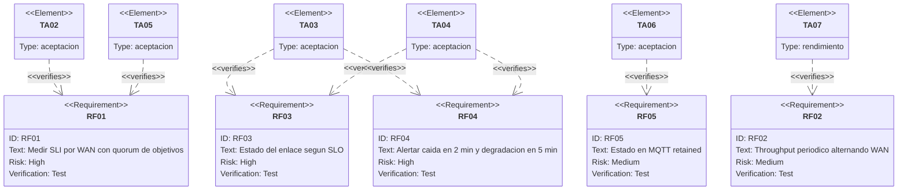
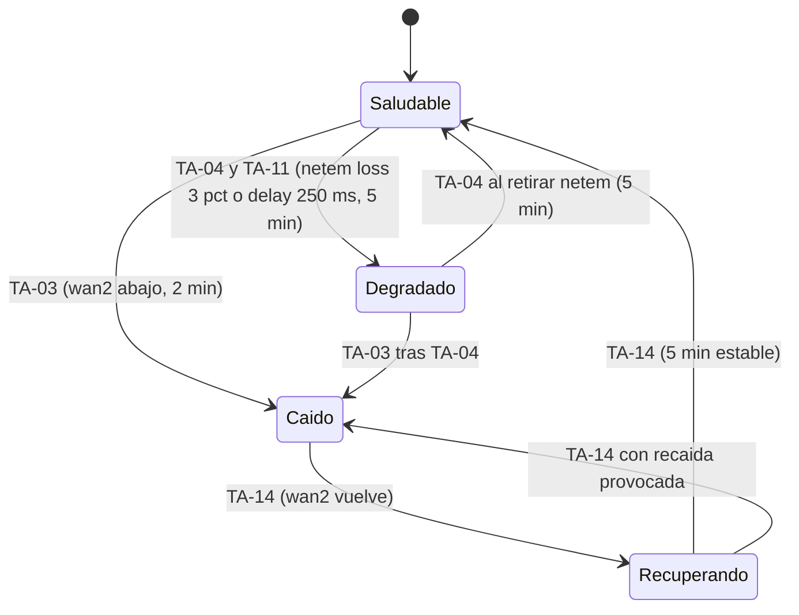

# Plan de verificación — Heimdall (Monitor SLA de internet)

* **Estado:** approved
* **Fecha:** 2026-09-05 (aprobado el 2026-09-09)
* **Decisores:** Jeremi
* **Fase AI-DLC:** 04-testing
* **Versión:** 0.5.0
* **Gate:** 3 (cerrado)
* **Alcance de prueba:** el sistema desplegado en midgard por el despliegue continuo (ADR-0005); no hay unidades de código que probar salvo dos scripts y dos nodos function
* **Requisitos cubiertos:** RF01–RF09, RNF01–RNF02, RS01, escenarios de abuso del PRD, amenazas T1–T5

## Estrategia
Heimdall es COTS configurado, así que la pirámide clásica se aplana en cuatro capas, cada una con su
puerta:

| Capa | Qué verifica | Dónde | Estado |
|---|---|---|---|
| Configuración | Sintaxis y semántica de Compose, reglas, Alertmanager, blackbox, flujo y scripts | CI `validar-configs.yml` en cada PR | Verde desde Gate 2 |
| Integración (despliegue) | Build → GHCR → webhook firmado → receptor → `pull` + `up -d` → sync → healthcheck | Primer despliegue de `v0.4.0` en midgard | **TA-01, arranque de Gate 3** |
| Aceptación funcional | RF01–RF09 y RNF01–RNF02 sobre el sistema real, con las WAN reales y fallos provocados | midgard, con `tc netem` y nftables para inducir pérdida, latencia y caídas | Este plan |
| Seguridad (DAST equivalente) | Los abusos del PRD y las amenazas T1–T5 como casos ejecutables: puertos, autenticación, ACL, secretos | Desde la LAN, desde una WAN externa y desde dentro de los contenedores | Este plan |
| Rendimiento | RNF01 (RAM y CPU) y calibración del techo de throughput que decide si `WanThroughputBajo` se activa | midgard, 24 h de datos reales | Este plan |

La evidencia se registra en este documento como resultado por caso (fecha, comando o consulta,
valor observado); nunca se copian IPs públicas ni credenciales (repo público). Los diagramas de
`architecture.md` no se duplican: aquí se anotan con el alcance de prueba.

## Alcance de prueba sobre la arquitectura

*Eje estructura · fase 04 · alcance de Gate 3. Rojo: superficies con caso de seguridad propio.*

## Trazabilidad requisito ↔ prueba

*Eje trazabilidad · fase 04 · medición y alertado.*

*Eje trazabilidad · fase 04 · observabilidad, no funcionales y seguridad. Cierra el círculo abierto en Gate 0 con relaciones `verifies`.*

## Casos de aceptación
Cada caso indica cómo se provoca la condición, qué se observa y dónde queda la evidencia. Los fallos
de red se inducen en midgard con `tc qdisc ... netem` sobre `wan1`/`wan2` y con reglas nftables
temporales; se retiran al terminar (`tc qdisc del dev wanN root`).

| ID | Requisito | Cómo | Resultado esperado | Evidencia |
|---|---|---|---|---|
| TA-01 | ADR-0005 | Fusionar `release/0.4.0` en `main`; observar el workflow `build`, el receptor (`/status`, journal) y `docker compose ps` | Imágenes `sha-<7>` en GHCR; despliegue `ok` con healthcheck de Odín; `sync-host` y `sync-net` salen con 0; 8 servicios arriba | `/status`, logs de sync, `docker compose ps` |
| TA-02 | RF01 | En Mimir: `probe_success{job=~"blackbox_.*"}` por `wan` y `target`; contadores `ip -s link` de cada WAN durante 5 min | 6 series (2 WAN × 3 objetivos) con valor 1; los contadores de ambas WAN crecen | Consulta PromQL, captura de Odín |
| TA-03 | RF03, RF04 | Retirar el cable de `wan2` (o `ip link set wan2 down`) y cronometrar | `WanCaida{wan="wan2"}` firing en ≈ 2,5 min (`for: 2m` + detección; SLO aceptado en Gate 3); `midgard/wan/wan2/estado = caido` retained; push recibido | Alertmanager `/api/v2/alerts`, `mosquitto_sub`, hora del push |
| TA-04 | RF03, RF04 | `tc qdisc add dev wan1 root netem loss 5%` durante 6 min (5 % y no 3 %: con 120 sondas por ventana la resolución es 0,8 % y al 3 % la ventana puede quedar por debajo del umbral por azar) | `wan:perdida_pct:5m{wan="wan1"} > 1`; `WanDegradada` en ≈ 6 min (`for: 5m` + ventana; SLO aceptado en Gate 3); `estado = degradado`; al retirar, vuelve a `saludable` | PromQL, Alertmanager, MQTT |
| TA-05 | RF01 (quórum) | Bloquear solo 1.1.1.1 con nftables (`ip daddr 1.1.1.1 drop` en output) 5 min | `probe_success` de 1.1.1.1 = 0 en ambas WAN; `wan:up` sigue en 1; **no** hay `WanCaida` ni `WanDegradada` (un objetivo caído no es pérdida del enlace) | PromQL, Alertmanager |
| TA-06 | RF05 | `mosquitto_sub -u iot -t 'midgard/#' -v` tras TA-03 y TA-04 | Mensajes retained en `midgard/wan/<id>/estado`, `midgard/wan/<id>/apto_llamadas` y `midgard/hogar/internet/estado` coherentes con las alertas | Salida de `mosquitto_sub` |
| TA-07 | RF02, RF09 | Esperar dos ciclos de Sleipnir (6 h) y ejecutar la calibración (abajo) | `wan_throughput_mbps` para ambas WAN y direcciones; alternancia visible en `wan_throughput_ultima_medicion_timestamp_seconds`; techo calibrado documentado | PromQL, tabla de calibración |
| TA-08 | RF06 | Abrir el dashboard `heimdall-sla` con rango 30 d; comprobar `--storage.tsdb.retention.time=30d` | Paneles con datos de ambas WAN; retención configurada | Captura anonimizada, `docker inspect` |
| TA-09 | RF07 | `wan:latencia_p90:5m`, `p95`, `p99` por WAN | Tres series por WAN, p90 ≤ p95 ≤ p99 | PromQL |
| TA-10 | RF08 | `wan:disponibilidad:30d` y `hogar:disponibilidad:30d` antes y después de TA-03 | Valores en (0,1]; el de `wan2` baja tras la caída; el del hogar se mantiene si `wan1` siguió arriba | PromQL |
| TA-11 | apto_llamadas | `tc qdisc add dev wan1 root netem delay 250ms` 6 min | `wan:apto_llamadas{wan="wan1"} = 0`; `WanNoAptaLlamadas` firing; `estado` sigue `saludable`; MQTT `apto_llamadas = no` | PromQL, MQTT |
| TA-12 | RNF01 | `docker stats --no-stream` cada hora durante 24 h (script) | Suma de RAM de los contenedores de Yggdrasil ≤ 1.5 GB; CPU media < 10 % del host | Tabla horaria |
| TA-13 | RNF02 | `sudo reboot` del appliance | Los 8 servicios vuelven solos; Odín responde; sondas miden | `docker compose ps`, `uptime` |
| TA-14 | RF03 (Recuperando) | Tras TA-03, reconectar `wan2` y cronometrar | `estado = recuperando` al resolverse la alerta y `saludable` a los 5 min sin recaída | MQTT con marcas de tiempo |

### Evidencia TA-01 (superado el 2026-09-06)
| Fecha (UTC) | Intento | Resultado | Causa / acción |
|---|---|---|---|
| 2026-09-06 03:48 | Merge de `release/0.4.0` → `build` (sleipnir y sync en GHCR, 44 s) → `workflow_run` firmado → receptor encola `sha-20cba13` | **Fallo** en `docker compose pull` a los 1,2 s: `ghcr.io/higerotech/yggdrasil-sleipnir` y `-sync` devuelven `unauthorized`; las imágenes públicas de upstream sí descargan | Paquetes GHCR nuevos nacen privados y el receptor hace pull anónimo. Acción: hacerlos públicos (runbook de CD, paso 3b) y relanzar el build. El circuito webhook → receptor → cola quedó verificado |
| 2026-09-06 04:13 | Paquetes públicos; `gh run rerun` → build OK → receptor despliega `sha-20cba13` | **Parcial**: `pull` + `up -d` en 118 s; los 10 contenedores `Up`; `sync-host` (checkout, render con wan2 nueva, blackbox recargado), `sync-net` (Mimir y Gjallarhorn recargados) y `nornas-init` (flujo importado) salen con 0; sondas `probe_success 1` por ambas WAN; Mimir con 9 targets `up`; RAM del stack ~183 MB. **Healthcheck agotado a los 120 s**: Odín tardó ~3 min en escuchar (migración SQLite del primer arranque en HDD) | `health_timeout` de la app subido a 300 s en `apps.yml` (servidor y repo). Tercer intento con arranques ya rápidos para dejar el despliegue registrado como `ok` |
| 2026-09-06 04:20 | `gh run rerun` → build OK (caché, 36 s) → receptor despliega `sha-20cba13` | **OK** en 40,6 s: `pull` + `up -d` 40,5 s, healthcheck de Odín `200` en 0,05 s; `current_tag` guardado (`sha-20cba13`, sin `previous_tag`); Sleipnir recreado con la imagen nueva; resto de servicios sin cambios | **TA-01 superado.** El receptor queda con estado para el rollback de los próximos despliegues |

### Evidencia TA-05 (2026-09-08; quórum superado, hallazgo corregido en v0.4.6)
| Hora (UTC) | Observación | Lectura |
|---|---|---|
| 01:03:00 | Tabla nftables `inet ta05` con `ip daddr 1.1.1.1 drop` en `output`, retirada por temporizador a +300 s | Inducción |
| 01:04:30 y 01:05:30 | `probe_success{target="1.1.1.1"}` = 0 en `wan1` y `wan2`; 8.8.8.8 y TLS = 1; `wan:up` = 1 en ambas; sin alertas | **Quórum correcto**: no hubo `WanCaida` |
| 01:08:50 | 1.1.1.1 responde de nuevo. Firing: `WanDegradada` y `WanNoAptaLlamadas` en ambas WAN | **Hallazgo**: `wan:perdida_pct:5m` promediaba los fallos de todos los objetivos, así que un objetivo bloqueado contaba como 50 % de pérdida. Corregido en v0.4.6: se excluyen los objetivos sin ninguna respuesta en la ventana y las sondas ICMP pasan a 5 s (resolución 0,8 %) |

### Evidencia de la tanda del 2026-09-08 (TA-02, TA-03, TA-04, TA-06, TA-08 a TA-12, TA-14)
Ejecutada desde midgard con `~/ta12/ta.sh` (inducciones con limpieza programada por `systemd-run`) y
observación cada 30–40 s de Mimir (`promtool query`), Gjallarhorn (`amtool alert query`) y los
mensajes retenidos de Ratatosk (`mosquitto_sub -u iot`). Horas en UTC.

| Caso | Observación | Resultado |
|---|---|---|
| TA-02 | 01:01:16 `probe_success` = 1 en las 6 series (2 ICMP + 1 TLS por WAN). Contadores en 7,5 min: `wan1` rx +258 KB / tx +1,10 MB, `wan2` rx +12,3 MB / tx +25,8 MB | **Superado** |
| TA-08 | Dashboard `heimdall-sla` con sus 10 paneles (hogar, estado por WAN, aptitud para llamadas, pérdida, percentiles, throughput, disponibilidad 30 d por WAN y del hogar, sondas, alertas); Mimir con `--storage.tsdb.retention.time=30d` | **Superado** |
| TA-09 | `wan1` p90 29,8 / p95 30,0 / p99 30,1 ms; `wan2` p90 45,7 / p95 46,0 / p99 46,8 ms | **Superado** (p90 ≤ p95 ≤ p99) |
| TA-11 | `netem delay 250ms` en `wan1` 01:13:50–01:19:50. A +43 s p95 = 279 ms y `wan:apto_llamadas{wan1}` = 0 con `estado` saludable; `WanNoAptaLlamadas/wan1` firing a +5 m 50 s; MQTT `apto_llamadas = no` a +6 m 21 s, `estado` saludable, `wan2` intacta. Resuelta a +5 m 19 s de retirar el retardo (ventana de 5 min); MQTT `si` 2 s después | **Superado** |
| TA-04 | `netem loss 5%` en `wan1` 01:27:02–01:33:02 (5 % y no 3 %, ver nota del caso). `wan:perdida_pct:5m{wan1}` 7,5–8,4 %; `WanDegradada/wan1` y `WanNoAptaLlamadas/wan1` firing entre +5 m 50 s y +6 m 33 s; MQTT `estado = degradado`, `apto_llamadas = no` a +6 m 33 s; hogar `ok`. Resuelta a +5 m 25 s de retirar la pérdida; MQTT `saludable` 32 s después | **Superado** con desviación de latencia (ver hallazgos) |
| TA-03 | `ip link set wan2 down` 01:38:32 (estado previo de `wan2`: degradado por un evento real). `wan:up{wan2}` = 0 a +28 s; `WanCaida/wan2` firing entre +2 m 18 s y +2 m 46 s; MQTT `estado = caido` a +3 m 14 s; hogar `ok` (`wan1` arriba). Transición Degradado → Caído del diagrama | **Superado** con desviación de latencia |
| TA-14 | `ip link set wan2 up` 01:42:32 (temporizador). `wan:up{wan2}` = 1 y `WanCaida` resuelta a +52 s. MQTT `recuperando` a 01:46:39 (+3 m 15 s tras la resolución: lote de Gjallarhorn). A 01:48:17 dispararon `WanDegradada/wan2` y `WanNoAptaLlamadas/wan2` con el enlace sano (la ventana de pérdida arrastraba el corte), así que Recuperando cerró en `degradado` (01:51:57) y solo pasó a `saludable` a 01:54:24, al llegar la resolución. Secuencia caido → recuperando → degradado → saludable: nunca caido → saludable directo | **Superado** en la máquina de estados; dos hallazgos corregidos en v0.4.7 |
| TA-06 | Durante TA-04/TA-11/TA-03 los retenidos `midgard/wan/<id>/estado`, `.../apto_llamadas` y `midgard/hogar/internet/estado` reflejaron cada alerta y cada resolución; el hogar solo pasó a `degradado` cuando ambas WAN estaban degradadas (efecto colateral de TA-05, 01:10). Retenidos al cierre (01:54): `wan1` saludable/si, `wan2` saludable/si, hogar `ok`, `nornas/heimdall/estado online` | **Superado** (con el retraso de resolución corregido en v0.4.7) |
| TA-10 | Antes de TA-03 (01:38:32): `wan1` 0,9692, `wan2` 1, hogar 1. Después (01:53): `wan1` 0,9694, `wan2` 0,9984 (bajó por los 4 min de caída), hogar 1 (`wan1` siguió arriba) | **Superado** |
| TA-12 | Recolector `ta12.service` (una muestra por hora, 24 h desde 01:02). Primera muestra: 367 MiB de RAM para los 7 contenedores, 2,8 % de CPU de contenedores, load1 0,33 | **En curso** hasta el 2026-09-09 01:00 |
| TA-13 | Reinicio autorizado el 2026-09-08 a las 12:12 UTC. SSH a los 274 s (unos 200 s de apagado y POST más 72 s de arranque), Odín `200` a los 403 s. Volvieron solos seis de los siete servicios: **Gjallarhorn quedó `exited` (255)** porque Docker lo marcó así al restaurar los contenedores y no le reaplicó `restart: unless-stopped` (`RestartCount` 0); el alertado quedó caído sin aviso. Se levantó a mano y se corrigió con `yggdrasil-arranque.service` (v0.4.9), verificada en midgard: con Gjallarhorn parado la unidad lo levanta sin recrear los demás contenedores | **Superado en la repetición** (ver abajo) |

**Eventos reales durante la tanda.** `wan2` mostró 1,7–2,5 % de pérdida sin inducción (las sondas a 5 s
lo resuelven; a 15 s no se veía) y a las 01:37:54 dispararon `WanDegradada/wan2` y
`WanNoAptaLlamadas/wan2`, resueltas 33 s después: la alerta es sensible a la pérdida real del ISP2.

**Hallazgos.**
- *Latencia de alertado.* Con `for: 2m` (caída) y `for: 5m` (degradación) la alerta llega a
  `for` + detección + lote de Gjallarhorn: medidos 2 m 18–46 s para la caída y ≈ 6 min para la
  degradación, frente a los 2 y 5 min que fijaba este plan. **Decisión HITL: aceptados los valores
  medidos** (2026-09-08); los casos TA-03 y TA-04 y el apartado de rendimiento quedan actualizados.
- *Resoluciones con retraso.* Las notificaciones `resolved` salen en el siguiente lote del grupo
  (`group_interval: 5m`), así que el estado MQTT podía ir hasta 5 min por detrás de Mimir (visto a las
  01:13, 01:38 y 01:46 en `wan2`). Corregido en v0.4.7: `group_interval: 1m`.
- *Degradación falsa tras una caída.* La ventana de 5 min de pérdida arrastra los fallos del corte y
  `WanDegradada` disparaba ≈ 5 min después de recuperar el enlace. Corregido en v0.4.7: las alertas de
  degradación y de llamadas exigen `min_over_time(wan:up[5m]) == 1`.
- *TA-05* (arriba): un objetivo caído contaba como pérdida del enlace; corregido en v0.4.6.

## Pruebas de seguridad (equivalente DAST): los abusos del PRD como casos
| ID | Amenaza / abuso | Cómo | Resultado esperado |
|---|---|---|---|
| TS-01 | T2, puertos internos | `nmap -Pn -p- <IP LAN>` desde un equipo de la LAN | Abiertos solo 22, 53, 3000, 1880, 1883 y los previos del router (9091, WireGuard); 9090, 9093, 9115 y 9469 filtrados |
| TS-02 | Exposición a internet | `nmap -Pn -p 22,1880,1883,3000,9090,9093,9115,9469 <IP pública>` desde fuera (móvil en datos) | Todo filtrado; solo WireGuard y el puerto de Transmission responden |
| TS-03 | T1, RS01 | `curl -I http://<IP LAN>:3000/api/dashboards/uid/heimdall-sla` sin sesión; login con la cuenta de `.env` | 401 sin sesión; anónimo deshabilitado; login correcto |
| TS-04 | T2 | `curl http://<IP LAN>:9090/api/v1/status/config` y `:9093/api/v2/status` desde la LAN | Sin respuesta (filtrado) |
| TS-05 | T3 | `mosquitto_sub` anónimo; `mosquitto_pub -V mqttv5 -u iot` en `midgard/x`; `-u frigate` en `midgard/x` y en `frigate/x` | Anónimo rechazado; `iot` y `frigate` en `midgard/#` reciben 135; `frigate` en `frigate/#` recibe 16 |
| TS-06 | T4 | `curl -X POST http://<IP LAN>:1880/heimdall/alertas -d '{}'` sin Bearer; editor sin login | 401 en el webhook; el editor exige credenciales |
| TS-07 | Elevation | `docker inspect` de cada contenedor: `User`, `CapAdd`, `ReadonlyRootfs`, `SecurityOpt` | Sin root salvo Mosquitto (baja privilegios), solo `NET_RAW` en blackbox, rootfs ro donde aplica, `no-new-privileges` |
| TS-08 | A05 secretos | `stat` de `deploy/.env`; `gitleaks` en CI; token no aparece en URLs de Alertmanager | 0600 `deploy`; CI limpia; token solo en cabecera |
| TS-09 | A06 supply chain | `docker inspect --format '{{index .RepoDigests 0}}'` de cada imagen vs `deploy/imagenes.md` | Digests coinciden |
| TS-10 | Tampering | Intentar escribir en Mimir desde la LAN (`curl -X POST :9090/api/v1/admin/tsdb/...`) | Inalcanzable; además la API de administración está deshabilitada |

### Evidencia TA-13 (2026-09-08; incidencias del entorno)
Durante la prueba ocurrieron dos hechos ajenos al software que conviene registrar porque condicionan la lectura:
- **`wan2` se colgó en el arranque.** A las 12:21–12:22 UTC el kernel registró `NETDEV WATCHDOG` en `wan2`
  (cola de transmisión bloqueada 71–82 s). Es el riesgo de la cadena USB del charter, que la tanda de
  aceptación no había vuelto a ver desde el cambio de adaptador.
- **Apagado manual.** A las 12:22:07 `systemd-logind` registró «Power key pressed short» y el equipo se apagó;
  volvió a arrancar a las 12:23:06. El segundo arranque no lo provocó la prueba.
En el arranque actual ambas WAN responden sin pérdida y los 10 objetivos de Mimir están en `up`.

### Repetición de TA-13 (2026-09-08 23:17 UTC): corte de corriente real
La repetición no hizo falta provocarla. A las 23:17:01 el appliance perdió la corriente de golpe: el
diario se corta en mitad de una tarea rutinaria, sin secuencia de apagado. Volvió 54 s después, a las
23:17:55, con la unidad `yggdrasil-arranque.service` (v0.4.9) ya instalada.

| Comprobación | Resultado |
|---|---|
| Los siete servicios vuelven solos | **Sí**; esta vez Docker restauró los siete por su cuenta |
| `yggdrasil-arranque.service` | Terminó con éxito a las 23:20:20; encontró los siete ya en marcha, ejecutó el importador de flujo y dejó constancia de la convergencia |
| Etiqueta usada | `sha-3d0e5e1`, la que el receptor tenía registrada: correcta |
| Odín, sondas y estado | 10 objetivos en `up`, ambas WAN sanas y el estado retenido en MQTT coherente |

**TA-13 queda superado.** La unidad de arranque no fue necesaria en esta ocasión, pero es la red de
seguridad para el modo de fallo del reinicio de las 12:12, en el que Docker dejó a Gjallarhorn fuera.

**Dos observaciones que quedan como limitación conocida, no como defecto:**
- *Heimdall no registra su propia caída.* Durante los tres minutos sin servicio no hubo muestras, y las
  reglas de disponibilidad promedian sobre las muestras existentes: un corte del appliance no aparece
  en `wan:disponibilidad:30d`. Medir la disponibilidad del propio observador exige un testigo externo,
  fuera del alcance de Heimdall.
- *Aviso cosmético.* Al converger con el Compose base, Compose advierte de contenedores huérfanos
  (`sync-host` y `sync-net`, de un solo uso). No afecta al resultado.

### Evidencia TA-12 (RNF01): 26 muestras horarias, 2026-09-08 01:02 → 2026-09-09 01:33 UTC
Recolector `ta12.sh` como unidad de systemd, una muestra por hora con `docker stats --no-stream`.

| Medida | Resultado | Criterio | Margen |
|---|---|---|---|
| RAM del stack, media | 406 MiB | ≤ 1536 MiB | 74 % libre |
| RAM del stack, máximo | 554 MiB (justo tras el corte de corriente, con Odín y Mimir arrancando) | ≤ 1536 MiB | 64 % libre |
| RAM del stack, mínimo | 247 MiB | — | — |
| CPU de los contenedores, media | 1,8 % | < 10 % | — |
| CPU de los contenedores, máximo | 4,3 % | < 10 % | — |

Reparto por contenedor al cierre (uso / límite declarado): Mimir 196/512 MiB, Odín 155/256, Gjallarhorn
66/128, Nornas 62/256, Huginn y Muninn 37/64, Ratatosk 1,6/64, Sleipnir 0,6/128. Mimir se queda muy por
debajo del umbral de 400 MiB que obligaría a revisar cardinalidad y retención.

La ventana cubre 24 h 31 min. El corte de corriente de las 23:17 dejó un hueco de 27 min entre dos
muestras, así que el recolector siguió hasta completar el día. Con la RAM máxima en el 36 % del límite
y la CPU media en una sexta parte del criterio, **TA-12 queda superado con holgura.**

### Evidencia TS-01 a TS-10 (2026-09-08, 02:15–02:40 UTC)
Desde un equipo de la LAN (192.168.10.74, `nmap` y `curl`) y desde midgard (`docker exec`, `docker inspect`, `nft`, `ss`).

| Caso | Observación | Resultado |
|---|---|---|
| TS-01 | `nmap -Pn` sobre 192.168.10.1: abiertos 22, 1880, 1883, 3000 y los previos del router (9091 y 51413 de Transmission); 53/tcp cerrado (DNS solo UDP); filtrados 9090, 9093, 9115, 9469 y 51820/tcp. Barrido completo de los 65 535 puertos (`nmap -Pn -T4 -p-`, 78 min): abiertos exactamente esos seis; 65 526 filtrados; tres puertos responden RST sin servicio a la escucha (53, y 6886 y 36675 del rango de Transmission). Un barrido con límite de tiempo por host marcó 22 y 1880 como filtrados: es pérdida de paquetes del propio barrido, desmentida por el escaneo dirigido y por el servicio (`ssh` responde, 1880 devuelve 200) | **Superado** |
| TS-02 | Sin vantage externo en la sesión: evidencia indirecta. `chain input` con `policy drop`; por `wan1`/`wan2` solo se aceptan respuestas DHCP (`sport 67 dport 68`) y WireGuard 51820/udp; 22/53 solo desde `lan`/`wg0`; 9115 y 9469 solo desde 172.16.0.0/12. Sockets de Yggdrasil ligados a 192.168.10.1 (1880, 1883, 3000) y 172.17.0.1 (9115, 9469). Ambas WAN están además tras el NAT del CPE del ISP | **Superado con evidencia indirecta**; el `nmap` desde datos móviles queda como HITL |
| TS-03 | `GET /api/dashboards/uid/heimdall-sla` sin sesión → 401; `GF_AUTH_ANONYMOUS_ENABLED=false`, `GF_USERS_ALLOW_SIGN_UP=false`; login con la cuenta de `.env` → 200 | **Superado** |
| TS-04 | Desde la LAN, `curl` a 9090 y 9093 → sin respuesta (timeout; código 000) | **Superado** |
| TS-05 | Anónimo: `Connection Refused: not authorised`. MQTT v5 con QoS 1: `iot → midgard/x` RC 135, `frigate → midgard/x` RC 135, `iot → frigate/x` RC 135, `frigate → frigate/x` RC 16; `iot` sí lee `midgard/wan/wan1/estado` | **Superado** |
| TS-06 | `POST /heimdall/alertas` sin Bearer → 401; `/flows` y `/settings` del editor sin login → 401 | **Superado** |
| TS-07 | Mimir y Gjallarhorn `nobody`, rootfs ro; Sleipnir 65532, `cap_drop ALL`, ro; Odín 472; Nornas 1000; Ratatosk arranca como root y el broker corre como `mosquitto` (uid 1883); todos con `no-new-privileges`. **Hallazgo**: Huginn y Muninn corrían como root con `CAP_NET_RAW`; probado en midgard con uid 65534 sin capacidades (`probe_success` 1 gracias a `ping_group_range`) y corregido en v0.4.8: desplegada a las 02:24 UTC (dos despliegues automáticos), Huginn y Muninn corren como `nobody` con `cap_drop ALL` y las cuatro sondas ICMP siguen en 1 | **Superado** |
| TS-08 | `deploy/.env` → `deploy:deploy 0600`; gitleaks en verde en cada PR; en `alertmanager.yml` renderizado ninguna `url:` lleva token y la autorización va en cabecera (`authorization`/`credentials`) | **Superado** |
| TS-09 | Digests en ejecución = `deploy/imagenes.md`: mosquitto `212f89e1…`, grafana `c132a683…`, node-red `427c7dce…`, prometheus `5ce7540c…`, alertmanager `690c7b52…`, blackbox `e753ff9f…`; Sleipnir `sha-797a356` construido en CI | **Superado** |
| TS-10 | Desde la LAN, `POST /api/v1/admin/tsdb/delete_series` a 9090 → sin respuesta; Mimir sin `--web.enable-admin-api` (solo `--web.enable-lifecycle`, alcanzable únicamente dentro de la red `heimdall`) | **Superado** |

## Pruebas de transición de estado (EnlaceWan)

*Eje comportamiento · fase 04 · state-transition testing. Transición inválida a comprobar: Caído nunca pasa a Saludable sin Recuperando (el flujo de Nornas lo impide).*

## Rendimiento y calibración del techo de throughput
- **RNF01** (TA-12): la suma de `mem_limit` es 1408 MB; se mide el uso real con `docker stats` durante
  24 h. Si Mimir supera 400 MB sostenidos, revisar cardinalidad y `retention` antes de tocar límites.
- **Latencia de alertado** (TA-03/TA-04): el cronómetro arranca al inducir el fallo y termina cuando
  el push llega. Medido en Gate 3: 2 min 18–46 s para la caída y ≈ 6 min para la degradación
  (`for` + detección + lote de Gjallarhorn). **Decisión HITL (Jeremi, 2026-09-08): se aceptan los
  valores medidos como SLO de alertado**; la histéresis de `for` evita falsos positivos.
- **Calibración** (TA-07): medir cada WAN hacia internet con la CLI oficial de Ookla ligada a la
  interfaz (`speedtest -I wanN -f json`) y contrastar con un `iperf3` en LAN entre midgard y un equipo
  del hogar, que acota el techo de la cadena NIC/USB del servidor. Decisión: si el techo ≥ 800 Mbps,
  `THROUGHPUT_RECEIVER=nornas` y la alerta queda armada; si es menor, el SLO se evalúa contra el techo
  calibrado (ajustar la regla) y se documenta como límite de medición, no del ISP. Repetir en dos
  momentos distintos y, si `wan2` vuelve a dar resets del r8152, descartar la muestra.

### Evidencia TA-07 (calibración del 2026-09-07; superado el 2026-09-08)
| Medida | `wan1` (ISP1) | `wan2` (ISP2) | Lectura |
|---|---|---|---|
| Sleipnir `0.1.1` en producción (`speedtest-cli`, primeros puntos) | 188 ↓ / 23 ↑ Mbps | 76 ↓ / 13 ↑ Mbps | No fiable: cliente Python limitado por CPU en el i3 y por servidores lejanos; contradice las medidas de abajo |
| CLI de Ookla `1.2.0` desde midgard, `-I wan1` / `-I wan2` | 16 ↓ / 940 ↑ Mbps | 939 ↓ / 487 ↑ Mbps | `wan2` en SLO de bajada; la subida de `wan1` prueba que la cadena USB llega al gigabit |
| `iperf3` en LAN, midgard ↔ equipo del hogar, ambos sentidos | 935 y 939 Mbps | | Techo de la cadena de medición del servidor |
| Sleipnir `0.2.0` en producción (v0.4.3), 00:32 UTC del 2026-09-08, servidor automático | 940 ↓ / 941 ↑ Mbps | 321 ↓ / 484 ↑ Mbps | Falso bajo en `wan2`: en el mismo minuto, desde la misma sonda, M21 Telecom da 312 ↓, Thundernet 941 ↓ y MDS Telecom 939 ↓. La elección automática de servidor no es fiable; Sleipnir `0.2.1` (v0.4.5) mide contra una lista y publica el máximo |
| Sleipnir `0.2.1` en producción (v0.4.5), 00:45 UTC del 2026-09-08, `OOKLA_SERVER_ID=51075,49339,56048` | 967 ↓ / 941 ↑ Mbps (máximo de Thundernet 967/779, MDS 965/938, SERVITEL 940/941) | 941 ↓ / 487 ↑ Mbps | Lecturas coherentes con la calibración en ambas WAN; `THROUGHPUT_RECEIVER=nornas` desde las 00:48 UTC (ruta `WanThroughputBajo → nornas` recargada en Gjallarhorn) |
| CLI de Ookla, segunda muestra, 18:58 UTC (`-I wanN -f json`) | 940 ↓ / 940 ↑ Mbps, ping 7,3 ms, jitter 0,7 ms, 0 % pérdida | 936 ↓ / 487 ↑ Mbps, ping 3,2 ms, jitter 0,2 ms, 0 % pérdida | `wan1` recuperada del todo; `wan2` repite la primera muestra |

- **Techo calibrado ≥ 939 Mbps**: el SLO de 800 Mbps es medible y no hace falta ajustar la regla.
- **`wan1` a 16 Mbps de bajada** durante la tarde de su caída (13:05 UTC) fue una degradación del ISP1,
  no del equipo: la subida por la misma interfaz daba 940 Mbps y a las 18:58 UTC la bajada volvió a 940.
  Queda como evidencia para el reclamo, junto con la caída de 13:05 a 14:25 UTC.
- **Sleipnir en modo `ookla`** (imagen `0.2.1`): `speedtest-cli` queda como alternativa. La elección
  automática de servidor dio un falso bajo en producción (312 frente a 941 Mbps), así que midgard mide
  contra tres servidores y publica el máximo. Con lecturas coherentes en ambas WAN, `THROUGHPUT_RECEIVER`
  pasó a `nornas` el 2026-09-08 a las 00:48 UTC: `WanThroughputBajo` queda armada y **TA-07 superado**.

## Criterio de salida del Gate 3
- TA-01 a TA-14 ejecutados con evidencia y resultado esperado, o desviación documentada y aceptada.
- TS-01 a TS-10 en verde; la matriz OWASP del PRD queda verificada, no solo declarada.
- Techo de throughput calibrado por WAN y decisión sobre `WanThroughputBajo` tomada.
- RNF01 y RNF02 medidos, no estimados.
- HITL: Jeremi acepta resultados y residual; se corta `0.5.0` y este documento pasa a `approved`.

### Cierre del Gate 3 (2026-09-09)
Los catorce casos de aceptación y los diez de seguridad quedan ejecutados con evidencia. Cinco defectos
salieron de las pruebas y se corrigieron y desplegaron durante el gate: la regla de pérdida con un objetivo
caído (v0.4.6), la degradación falsa tras recuperar una WAN y el retraso de las resoluciones (v0.4.7),
las sondas ejecutándose como root (v0.4.8) y el stack que no converge tras un arranque (v0.4.9). Antes,
la calibración del throughput obligó a cambiar de método de medición (v0.4.3 a v0.4.5).

Desviaciones aceptadas por Jeremi: la latencia de alertado medida (≈ 2,5 min para caída y ≈ 6 min para
degradación) pasa a ser el SLO; TS-02 queda con evidencia indirecta del cortafuegos, a falta de un punto
de observación fuera de la red; y el riesgo del adaptador USB de `wan2` queda aceptado con vigilancia, porque la enumeración del arranque puede dejarlo colgado aunque en marcha sea
estable. Limitación conocida: Heimdall no registra su propia caída.

